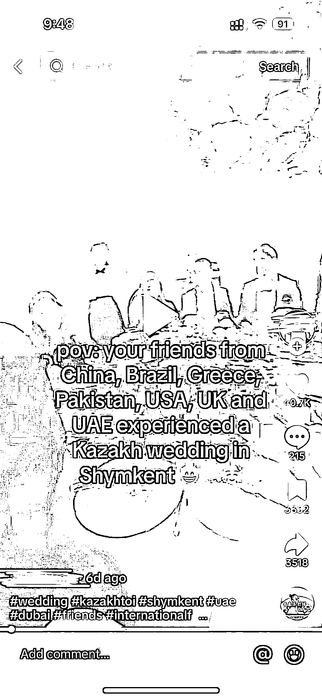
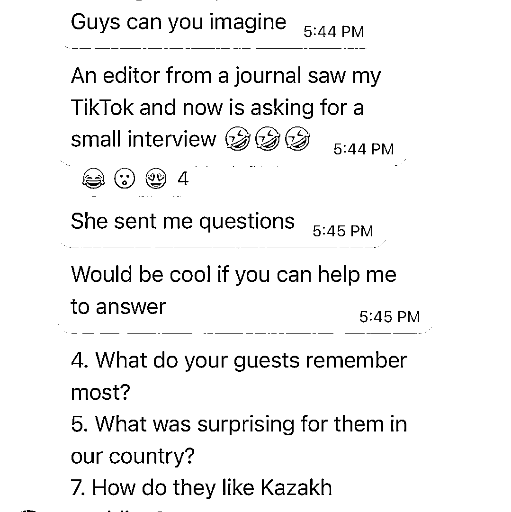

# TikTok 视频爆红，思考如何利用内容赚钱

> 原文：[`www.yuque.com/for_lazy/xkrm14/hvhhty9p52rwipet`](https://www.yuque.com/for_lazy/xkrm14/hvhhty9p52rwipet)

作者： TingTing

日期：2023-09-19

点赞数：**48**

* * *

正文：

最近朋友的 TikTok 视频爆了，我们一群人甚至被采访然后上了当地生活方式媒体，给我带来一些思考： 1.
账号粉丝不到一百，但因为内容而被疯狂传播，戳中人的是“在我的家乡”（和观众带来连接）+与我年纪相仿的国际朋友（冲突点，大部分人没有）+参加婚礼（是一个很有趣的场合）
2\. 一个视频的火爆同时带动了账号下其他内容播放量的提升 3\. 内容被看见后，机会会找上门，因为有很多平台或机构需要更多更有趣的内容，这是相辅相成的
4.
我看到了这个账号后期如果继续发展其实可以延续“外国朋友”这个方向，变现或许可以通过接出国留学广告或采访？不过估计我朋友暂时没这个想法，内容的生产本身是个工作量巨大又需要持续性的事情
5\. 最后的感想就是 TikTok 的流量真的很大！有巨大的潜力 第一次发风向标，不知道格式和内容对不对

* * *

评论区：

TingTing : 哇，太开心了！加入两个月第一次分享就中标，也谢谢朋友鼓励发帖

大理阿彬 : 恭喜恭喜🎉不用谢我，你全凭实力哈哈哈[耶]

* * *

