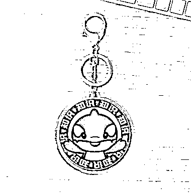
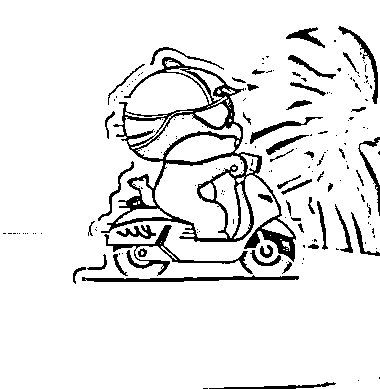

# 推荐两个好用的文创周边网站，一件起订，适合企业定制和个人创作

> 原文：[`www.yuque.com/for_lazy/xkrm14/bbgaw713zqo8im4p`](https://www.yuque.com/for_lazy/xkrm14/bbgaw713zqo8im4p)

作者： 莹火虫💋

日期：2023-09-19

点赞数：**191**

* * *

正文：

最近在研究公司的文创周边，发现有两个特别好用的网站可以推荐给大家。一个叫自个儿网，一个叫柔造。这俩网站都是一件起订的，前者服装包包笔本比较多，适合企业定制队服，办公用品什么哒。后者小玩意居多，冰箱，亚克力摇摇贴，各种贴纸胸章抱枕啥的，适合有一定受众的博主或者品牌做点自己的周边，巨便宜，还能直接生成链接图片挂到自己小红书店铺销售，不用囤货就能挣钱。我看到一直关注的表情包博主“内在小孩”，就是他家客户。如果用 AI 做头像表情包卡片或者粘贴等线下产品的，可以重点关注一下后面这个网站。

* * *

评论区：

花与飞 : 这条信息真的是我目前刷到的风向标里对我来说最重要的一条了[流泪]

宋东波-进击 2030 : 很实用 有价值

莹火虫💋 : 刚好最近在研究周边就分享出来啦

莹火虫💋 : 柔造真滴好，能直接把链接挂到小红书店铺上！

莹火虫💋 : 谢谢大佬！

老彭 : 老哥展开讲讲啊，怎么重要了

老彭 : 这条信息真的好！！！

* * *

