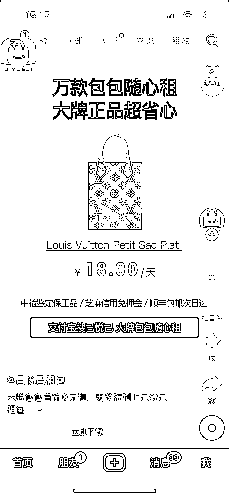
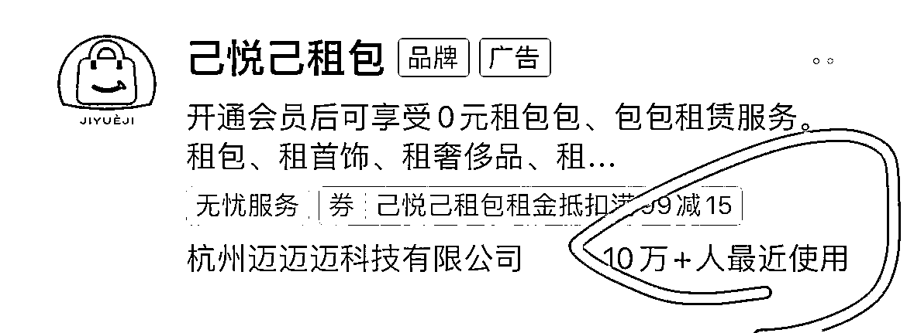

# 奢侈品包包按天租赁生意火爆，经济下行下女性市场成新宠

> 原文：[`www.yuque.com/for_lazy/xkrm14/gbbhf6z5wpxg5tia`](https://www.yuque.com/for_lazy/xkrm14/gbbhf6z5wpxg5tia)

作者： May

日期：2023-09-18

点赞数：**98**

* * *

正文：

在抖音看到个广告推送，奢侈品包包也有按天租的生意了。去支付宝搜了下，流量不小。算了笔账，一个卖 2.4w 的包，租 30 天需要 2k…
看到这个脑子里冒出的第一个感受： 经济下行+女人钱是真的好挣啊

* * *

评论区：

Nicole : 我用过 一点点贵

顾怀 Aria : 这个之前一直都有。只不过都慢慢地倒闭了。这是又出来一个新的

May : 哈哈哈 好吧，大数据第一次推送给我

竹影 : 只能说有些人的世界搞不懂，不参与

顾怀 Aria : 但他这个定价是真贵啊

姜姜 : 这个可以 ，包包租赁业务

* * *

