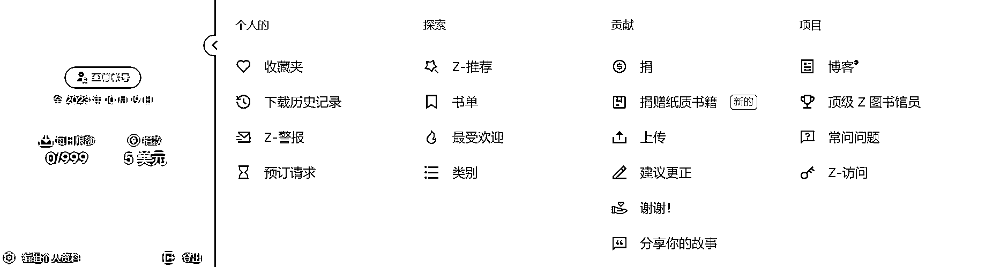
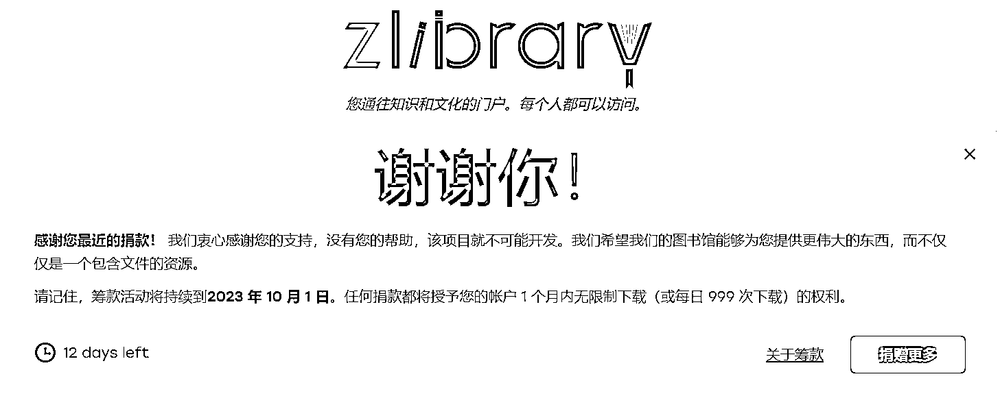

# Z-library 再次筹款，捐赠 5 刀即可享受高级用户权限，每天最高下载 999 本书

> 原文：[`www.yuque.com/for_lazy/xkrm14/zqht8vl7qdcigma8`](https://www.yuque.com/for_lazy/xkrm14/zqht8vl7qdcigma8)

作者： 江南 style

日期：2023-09-18

点赞数：**91**

* * *

正文：

Z-library 又开启筹款了，筹款时间 9 月 15-10 月 1 日。最低捐赠 5 刀（人民币不到 36 元），就可以获得高级用户权限，每天最高🉑下载 999 本书。喜欢阅读电子书或者需要大量电子书的朋友，可以试试。九月份出版的《埃隆·马斯克传》，中英文版本，z-library 上已经有了。

* * *

评论区：

胖大魔 : 有台版书么

江南 style : 你能想到名字的，一般情况下都有

世界倒着看 : 现在好像登录不上去，一直显示 The cf-turnstile-response field is required.

阿杰努力成长 : 捐了 1 美元，7.16

王一一 : 怎么用啊

王一一 : 域名是什么

一草团 : 后缀.is .io .to 都是钓鱼假冒，小心上当

* * *

公众号懒人找资源，懒人专属群分享