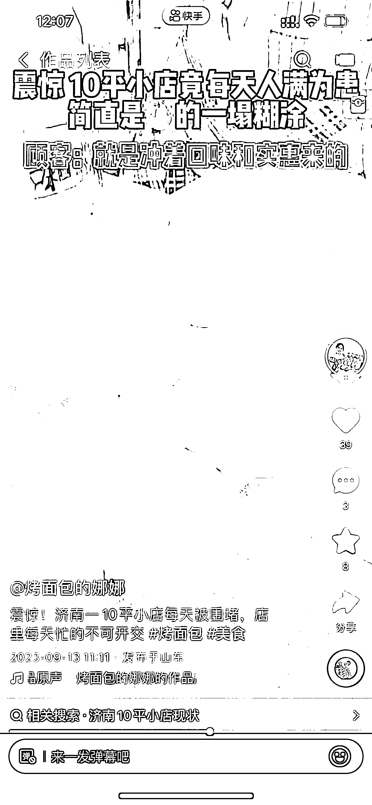

# 济南 2 元社区面包店，开业两周，日营业额达 4532 元

> 原文：[`www.yuque.com/for_lazy/xkrm14/czq8v9gqs4qk82rk`](https://www.yuque.com/for_lazy/xkrm14/czq8v9gqs4qk82rk)

作者： 随想

日期：2023-09-18

点赞数：**84**

* * *

正文：

济南 2 元社区面包店，开业两周，日营业额 4532 社区 2 元面包店，刚开业 2 周左右【8 月底试营业，9 月初开业】，人流不小，轻烘培，单品策略 【亮点】
1.和之前 名创优品 2 元店起家，有点类似，40%毛利率 2.挣两笔钱：一笔是店的正常营业额；另一笔为培训费； 3.所需成本：一台和面机
、一台烤箱、工人工资、水电煤费用 4.人均 10 元-20 元消费。单品面包，品类：椰蓉、豆沙、酸奶、黑米核桃、开胃山楂馅、蔓越莓等。现做现烤。
5.一个从业烘焙 15 年的行内人点评：
从一个专业角度给分析一下，看他下班时间还是傍晚，一个员工每天最多也就能做出 500 个面包，也就是 1000 元他卖 5000 就得 5 个人。
一个面包师工资普遍 200 一天，还得包吃住，工资加吃住加房租得 1500+。2 块一个面包，毛利率在 40 左右，也就是一天除去所有开销净利润在 500 左右。

* * *

评论区：

数字画师 Frank : 现在面包越来越贵了。有 2 元面包我肯定天天早晨都买。。

随想 : [抱拳]年轻人早点市场

闫君 : 47 个视频都看完了，基本可以判断是做招商加盟的。一开始她是做烟囱面包 后来又做的 2 元面包。其中有几条视频是有软广的。暗示可以教学，投资低。

随想 : 培训是她的一块收入，这种面包店做加盟的可控性不大，因为原材料和供应链相对来说比较简单，这些个材料可以很方便买的到。如果我是老板的话，单店经营是基本面，不断提炼/提升单店盈利模型：坪效、客单、复购、衍生品类。然后会输出培训增值体系，例如：线上流量获取、社群运营等等

球哥笔记 : 别加盟，割韭菜的，亲身经历，装修人工和租金大头，自己没自由，回本 3 年以上

随想 : 哦哦，2 元面包店，没必要加盟，学习一下面包制作流程就好。
装修可以自己找（10 平米左右的，简单装修几千块可以搞定），房子选择社区周边的，或者刚开始在家里做，在小区门口买，有了正反馈后再租社区周边的门面房的。
95 后做这事最大的优势 可以用自媒体引流和社群运营，，

陈陈陈 : 2 元、2.5 元一个面包，毛利还有 40%嘛

* * *

