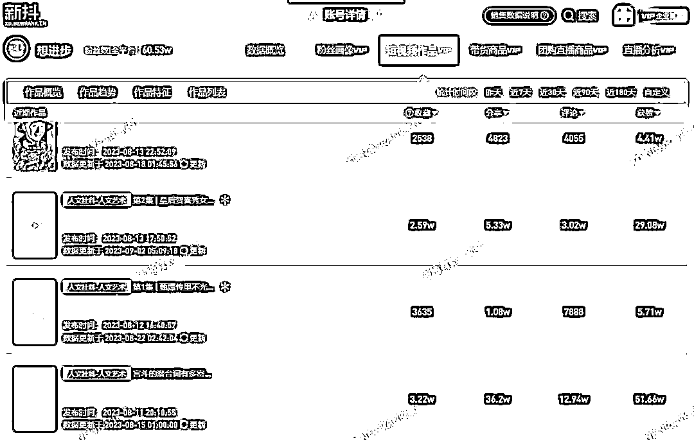

# 剧情解读：逐句解析台词背后的深意，画面定帧加滤镜，配上“中译中”潜台词解说

> 原文：[`www.yuque.com/for_lazy/xkrm14/fshflhs457syga34`](https://www.yuque.com/for_lazy/xkrm14/fshflhs457syga34)

作者： 大王

日期：2023-09-21

点赞数：**67**

* * *

正文：

将一段剧情切割成 N 段，逐句解读台词背后的深意，并将画面定帧加上滤镜作为区分，配上“中译中”的潜台词解说。
想进步”等账号不到一个半月实现粉丝量从 1 万到 60 万的跃升。
比如“想进步”视频中的热门引流产品“人情世故 23 讲”，售价 39.9 元、累计卖出了 7.9 万份，仅这一门课程就卖了 315 万元。

* * *

评论区：

财火 : 这个文案，

* * *

