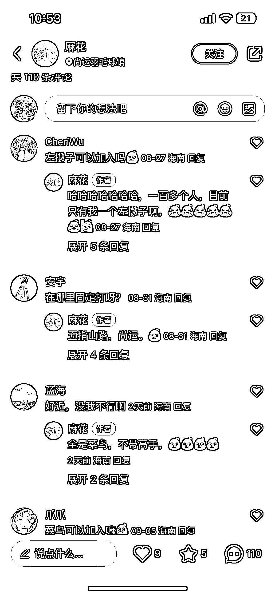

# 羽毛球入门教学的缺口和可操作性分析

> 原文：[`www.yuque.com/for_lazy/xkrm14/xfgespogxyliwb2o`](https://www.yuque.com/for_lazy/xkrm14/xfgespogxyliwb2o)

作者： xiao.^☀

日期：2023-09-21

点赞数：**53**

* * *

正文：

小众赛道，最近在看羽毛球入门相关，没看到什么系统型知识。 【缺口】
身边有朋友想入门羽毛球，而我本身也跟教练正规训练过，加上一直在看抖音、知乎、小红书各种平台内容，发现并没有很好的面向入门选手的集合，都比较散，不利于新手有个大概的规划蓝图。
【现状】
很多教练其实有系统型的训练方法，但是他们非常不善于总结提炼，只会零散细碎地分享（不管是在网上还是生活中），如下图 2，其实很散，集合了小技巧分享、规则分享初学者分享，从知识架构上来看相关性很低，放在一起很误导小白类型的球友。
【可操作性】 如果能像别的类型的教育（比如三节课产品经理课程）一样，做成分系列、分 level、分步骤的教学目录模式，并不难，却很稀缺。
而且非常有利于业余整体水平的提高。 只要做得好，也有很多人愿意买 - 身边不少人都在找教练学习，价格大概是： · 1v1 一小时 150-300 ·
多人班一次 100-150 - 也有认识的人会话几千买国手的 bilibili 高阶课程
另外，新手球友非常缺乏水平相当的搭子一起打球。除了系统型的教育，还可以有圈子建立的辅佐

* * *

评论区：

* * *

