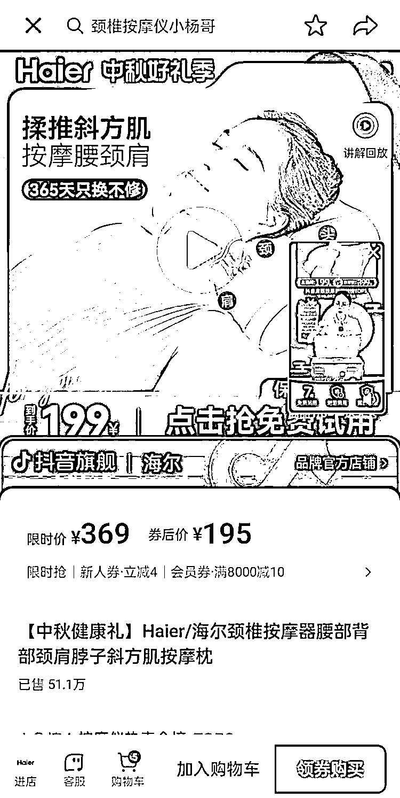

# 适合送礼或自用的海尔腰颈肩按摩仪，满足多种人群需求

> 原文：[`www.yuque.com/for_lazy/xkrm14/srl8ix9lm6ii7x3b`](https://www.yuque.com/for_lazy/xkrm14/srl8ix9lm6ii7x3b)

作者： 流年

日期：2023-09-19

点赞数：**54**

* * *

正文：

海尔腰颈肩按摩仪有高频、受众广、刚性的需求，适合送礼或买给自己用。
白领、全职妈妈、中老年人和看手机的低头族都会用到腰颈肩按摩仪，使用按摩仪的人群以中老年人为主。
长时间低头工作或看手机、做家务等都会造成腰酸背痛或脖子痛，使用腰颈肩按摩仪。 抖音中海尔腰颈肩按摩仪单价为 195 元，已售 51.2 万件。

* * *

评论区：

佩佩 : 我就买了一个，真的挺不错的

流年 : 嗯嗯，对自身有帮助就好

胖大魔 : 这个按摩效果一般般，之前给我妈买，我妈说再也不用我帮她按，结果还是要我帮她按

迷途小书童的 Note : 还有推荐的不？

胖大魔 : 筋膜枪，但是部分中老年人受不了，打不了脖子

胖大魔 : 中频治疗仪，可以先去体验一下

迷途小书童的 Note : 🙏

* * *

公众号懒人找资源，懒人专属群分享