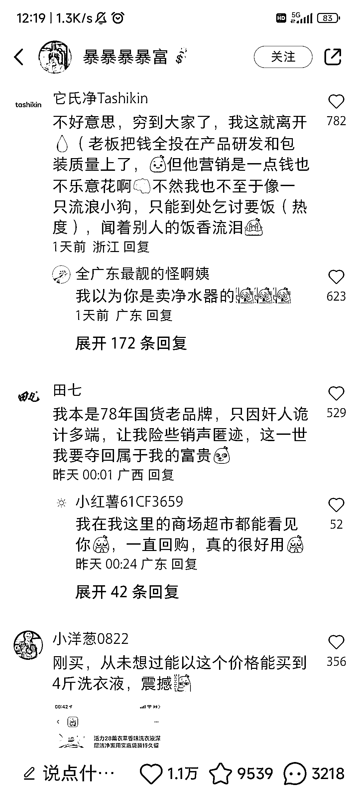
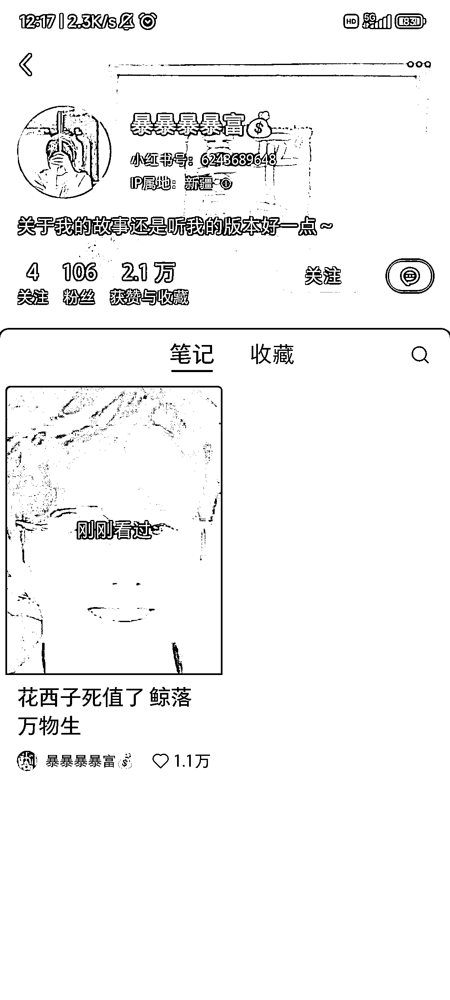

# 李佳琦事件引发国货分享内容流量暴增

> 原文：[`www.yuque.com/for_lazy/xkrm14/kdme8gc40sqoe27a`](https://www.yuque.com/for_lazy/xkrm14/kdme8gc40sqoe27a)

作者： 物女金

日期：2023-09-19

点赞数：**55**

* * *

正文：

受李佳琦事件影响，最近国货分享内容流量巨大 新号发布第一条都能 1.1 万点赞 笔记爆了以后立马会有广告联系过来合作 一条 400-1.5k 左右不等
可见在小红书热点+共鸣人设=流量变现密码

* * *

评论区：

奈斯儿 : 请问是在评论区接广告吗，400-1.5k

* * *

