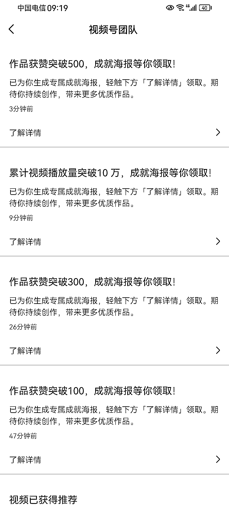

# 视频号带货，单视频播放量破 20 万+，私信咨询下单 10 个以上

> 原文：[`www.yuque.com/for_lazy/xkrm14/ws8ca2g0s8407eqk`](https://www.yuque.com/for_lazy/xkrm14/ws8ca2g0s8407eqk)

作者： 三恒

日期：2023-09-01

点赞数：**75**

* * *

正文：

视频号带货，新手实操第 2 天，单视频播放量破 20 万+，早上大概八点多发的视频，九点一看消息 999+，私信咨询下单的 10 个以上，目前数据还在上升！
所以想做视频号带货的，虽然说在大佬眼中这不算什么大红利，但是相对其他平台我认为不管是从起号-
私域还是变现，都值得去做一做，对于想“赚点小钱”的人来说还是可以去做的！
关于经验，我想说的是：一切都会变，但是人心不会！所以抓住你目标用户群体的那个“点”是关键，从营销的角度出发，满足他的心理或者需求因素，直接打疼点。同时，抖音、小红书的爆款理论依然适用于视频号！

* * *

评论区：

xinz : 啥也没讲~~

三恒 : 你想要啥？

吾爱诗词 : 带书吗？

三恒 : 对

在三亚卖金枪鱼和野生* : 海南财友？

三恒 : 对呀，我在群里

汪汪结 : 需要偷流吗

* * *

公众号懒人找资源，懒人专属群分享