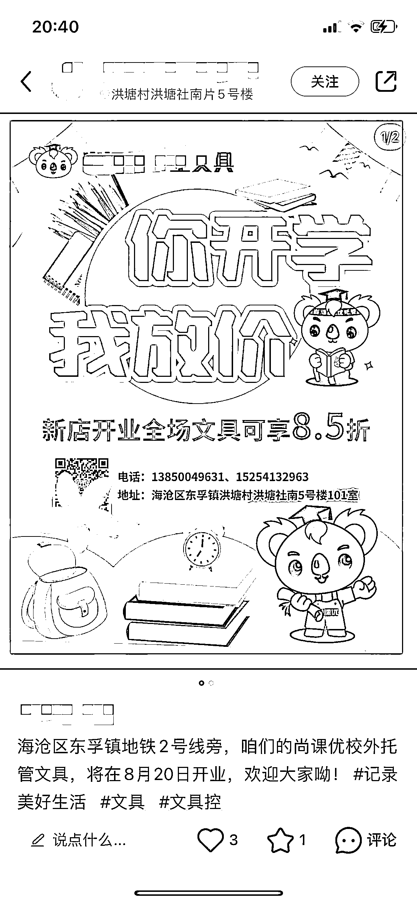

# 小红书教培行业涌入大量机构，但违规海报成为瓶颈

> 原文：[`www.yuque.com/for_lazy/xkrm14/fsgel1seabs7kmva`](https://www.yuque.com/for_lazy/xkrm14/fsgel1seabs7kmva)

作者： 蚂蚱有计

日期：2023-08-30

点赞数：**49**

* * *

正文：

小红书尝试教培招生赛道的过程中，发现一个有意思的现象，教培行业因为某些原因，大量机构为了增加宣传力度，很多涌入小红书，相信各种新开店的都在进入。但是他们不懂平台规则！上来就发含有违规海报的笔记，，尤其是带二维码的，还不知道为什么流量不行。这里面有机会！想做小红书代运营之类的没有教培经验就不要坑人了。但是感兴趣的朋友可以尝试一个专营违规提示员之类的账号，收费服务，只负责指出违规事项，给予基本纠正，并可以提供小红书违规词检测。

* * *

评论区：

艾小飞 : 我有个好的思路，可以跟他们合作，你负责引流和转化，他们负责交付，55 分。如果合作不成，客户还在你私域上，掌握主动权

蚂蚱有计 : 确实可以，有很多小红书招生陪跑，不过他们多有区域限制，但肯定比硬性地推强，谢谢你的建议👍

老彭 : 嗯，我在做职业教育，也是差不多，同行根本不会玩小红书

蚂蚱有计 : 一个是大牌升级宣传和招生渠道，一个是很多新手校长，抓一抓机会!

* * *

公众号懒人找资源，懒人专属群分享