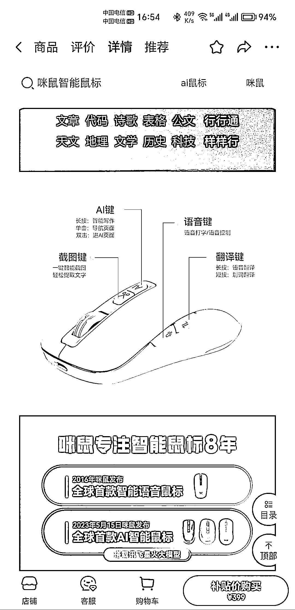

# AI 鼠标：语音输入、生成 PPT，老年人办公新选择

> 原文：[`www.yuque.com/for_lazy/xkrm14/ge9nm1slnltafbms`](https://www.yuque.com/for_lazy/xkrm14/ge9nm1slnltafbms)

作者： AI 同行侠-文卓

日期：2023-08-31

点赞数：**71**

* * *

正文：

AI 鼠标全网已售出 60000+，可以语音输入，生成 PPT， 划词翻译等等。 老年人想要用电脑办公，不会打字怎么办？ 用鼠标的语音输入功能解决。
以后电子设备做入口，搭配 AI 功能的产品应该会越来越多。

* * *

评论区：

卓一月 : 哇！这个市场应该很大

田新一 : 用了两年了，买了以后，你会发现，并没有什么用处[捂脸]

星空 : 越来越高科技了

天使陷落 : 这对不会用电脑的人，是个空白市场吧

AI 同行侠-文卓 : 所有的电子设备都可以用 AI 重新来一遍

AI 同行侠-文卓 : 不要局限鼠标，所有电子设备都可以，例如平板电脑 + AI 导师，这个事情讯飞在落地

AI 同行侠-文卓 : 会用电脑的也是个大市场，把鼠标换成任何电子设备，逻辑也成立。

* * *

公众号懒人找资源，懒人专属群分享