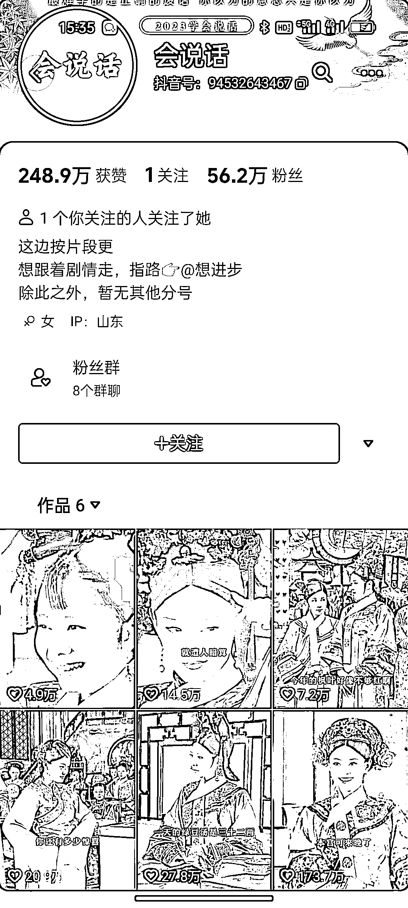

# 逐帧分析甄嬛传的号，涨粉 50w+，卖情商课解决年轻人社交难题

> 原文：[`www.yuque.com/for_lazy/xkrm14/wd3xlg22n2ua7ukl`](https://www.yuque.com/for_lazy/xkrm14/wd3xlg22n2ua7ukl)

作者： 碎碎念与自言自语

日期：2023-08-29

点赞数：**109**

* * *

正文：

最近在小红书和抖音发现两个逐帧分析甄嬛传的号，叫会说话和想进步 快速涨粉 50w+，每条视频都是爆款 已经有很多号在跟了
变现方式是卖“高情商办事课”“人情世故 23 讲”等课程，40 块一份已卖出 7.6w 份
分析经典电视剧台词，话题自带热度，同时戳中了年轻人进入社会后因不懂人情世故而吃亏的痛点，并提出解决方案。 同时客单价也不高，降低用户决策成本，更容易购买。
粉丝群也有近万人了，这种群会自己活跃起来，我进群晚，不知道是否会有引流动作。

* * *

评论区：

碎碎念与自言自语 : 感谢亦仁大大！[呲牙]

HDDD : 这个课程是他自己的吗？还是抖音商城里可以分销的？

* * *

公众号懒人找资源，懒人专属群分享