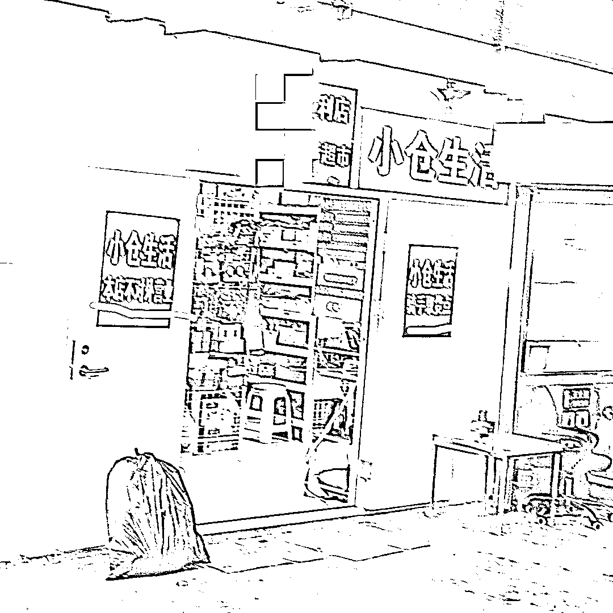

# 北京五环外的生活超市门口，商业流量底层逻辑悄然变化

> 原文：[`www.yuque.com/for_lazy/xkrm14/olh73gi4ng1692m7`](https://www.yuque.com/for_lazy/xkrm14/olh73gi4ng1692m7)

作者： 张五哥

日期：2023-08-30

点赞数：**59**

* * *

正文：

在北京五环外还算热闹的生活超市门口，貌似小超市门口赫然写着本店不对外营业。实体生意已经可以完全不考虑线下的进店客户了，商业流量底层逻辑悄然变化，很多传统生意都有重新做一遍的机会

* * *

评论区：

乔朗 : 我去，兄弟这我家门口呀，有缘认识一下？ PMqiaolang

初 : 不对外营业是当仓库使用，然后建一个平台可下单送货上门吗 ？

挖哈的阿抓 : 是啊，现在美团上面很多日用百货便利店万单

初 : 是出售自己的时间配货送货上门？如果仅仅是这样，比传统小超市有余，比大型商超不足，是我眼拙，没看出有什么厉害的地方。大型超市也可以外卖形式呀。而且现在人口密集的社区基本都有中大型商超入住。

挖哈的阿抓 : 就是专门做外卖的，超市，在美团上搜搜看，看看有没有万单店

才 : 这个可以结合，仓库直播来做，收坑位费，或者拿物品售出的点

* * *

公众号懒人找资源，懒人专属群分享