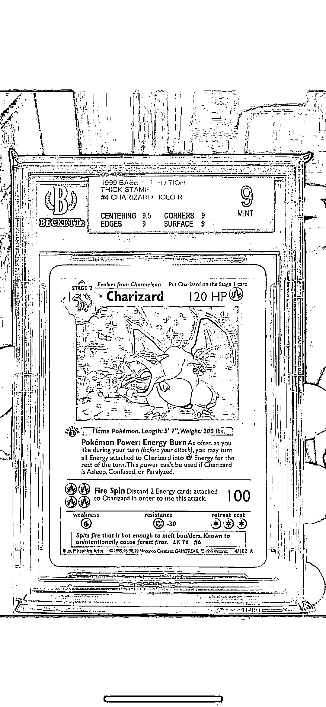

# PTCG 宝可梦卡牌科普：评级机构和鄙视链解析

> 原文：[`www.yuque.com/for_lazy/xkrm14/alwovoqlbx541yf9`](https://www.yuque.com/for_lazy/xkrm14/alwovoqlbx541yf9)

作者： BruceZhang

日期：2023-08-31

点赞数：**39**

* * *

正文：

PTCG 宝可梦卡牌科普 PTCG 宝可梦卡牌最早起源于日本，在全球范围内，除了日版还有美版、繁体中文版、泰语版、印度尼西亚版本，后面在去年出了简体中文版。
一般来讲无论哪个国家的版本，都会定期发售新系列的盒子，盒子里面是卡包，卡包拆出来就是卡牌，卡牌有罕贵度之分，一箱是 12 盒，每一个系列的卡牌最好看最热门且罕贵度最高的卡，可能就两三张，12 盒里面不是平均分配的，可能一张好看的都没有，也可能同时有好几张。但一般来讲，一个盒子里面会有 1-2 张最稀有的卡。卖的很火的系列是有可能官方发布加印公告的，但加印往往是在同一时间段内，官方是不会加印很久之前的盒子的，也就是说，基本发布完过一段时间，盒子就绝版了，没开的盒子是越开越少。
1.评级机构
然后再科普一下评级机构，比较主流的评级机构有 PSA、BGS、CGC，以 10 分为满分，因为卡牌比较脆弱，可能不小心受潮了受紫外线影响了或者不小心刮到/厂伤，都会让卡牌显得不完美，所以基本上来讲 10 分的卡牌就可以当成完美卡来对待，评级壳子具备防紫外线、防水等功效，可以让卡牌过 10 年 20 年还和最初一样。
在这个产业链里，评级机构会做几个事情，一个是用自家的标准来给卡牌评分，第二个是统计自家不同卡片不同级别的数量，比方说一张卡，如果 PSA10 分的有 1 万张，那基本上来讲这张卡就很难涨上去，因为数量太多了，大卡贩子无法形成垄断，一旦上涨一些，就会有获利盘释放流动性，卡家就容易下去。所以每张卡在评级机构的 Population 是一个很重要的数据，举个例子，如果一张 2001 年的老卡，特别好看，在全球范围内只有 100 张 PSA10，那市场上的流动性基本上可能就 3-5 张，卡贩子只需要把市面上能买到的都扫货扫掉，就拥有一定程度的定价权了。
2.鄙视链 卡圈是有鄙视链的，鄙视链的形成主要是因为卡价、工艺，从全球流通性的角度来看，讲日版>美版>简中>繁中
卡店我们要区分中国的卡店还是日本的卡店，日本的卡店基本上来讲，生意模式并不是囤盒，而是直接买卖罕贵度比较高的卡（分看画品、流通品和美品），以及评级机构的卡，以及卖店铺自产自销的盲盒/福盒。一般收卡的价格是当期市场价的 8 折，赚的钱我认为是买卖利差，操纵市场炒高卡牌后控盘的利差，这么做其实是高资金周转率的一种玩法。囤盒赚钱的确实有，但往往其实是囤日版老版本的盒子（且盒子里面有比较好看的卡）才有用，囤盒模式的资金利用效率其实很低，往那一放起码 3-5 年起步，等于做了个后期流通性也不是特别好的定期存款。
好一点的盒子，基本发布前就得定&抢，不好的盒子，完全没人买。这个无论放在哪个语言版本的卡里都一样，国内最近喷火龙礼盒 400 块钱抢疯了，因为大家认为卡片一评级一张卡就能卖到 1000+，但是后面不限量出的一些版本就完全没人想要，因为卡太丑。。
3.价值锚点
很早的时候我就问过一个问题，NFT 的价值锚点是什么。CSGO 饰品市场、PTCG 的价值锚点又是什么，这里面经过大概一年多两年的时间，我还是获得了一些新的答案。
最早我的思考是，发售方的信用（不会偷偷印刷老板本）、人们对这个东西的支付意愿和供需关系（流通性到底好不好，卡价是不是一直在涨，是不是稳定的），以及 IP 的生命力在下一代人的潜在受众到底大不大
现在来看的话，其实上面这几个答案我还是这么认为的，但是会加几个炒商在里面炒货的逻辑，比方说把远古的某一系列炒的爆火，或者把某一个人物卡炒的爆火，然后用最贵一张人物卡拉动这个人物其他系列的卡价，以及其他人物卡（比方说 5 月开始妹卡发疯涨，就是这个逻辑，黄昏莉莉艾涨到 100-130 万人民币一张）

* * *

评论区：

AI 同行侠-文卓 : 让我想起动漫<游戏王>的卡片

BruceZhang : 选择国际社会都认可的 ip，比如迪士尼的 IP，受众广才好赚钱

* * *

公众号懒人找资源，懒人专属群分享