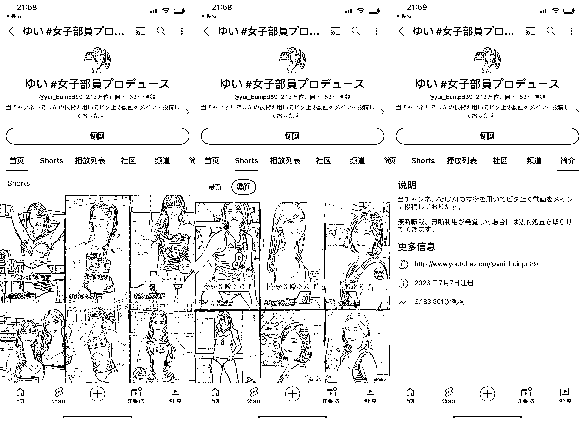

# AI 绘画自媒体在 YouTube 日本市场获得火爆，对于面向日本市场的 YouTube 账号有启发

> 原文：[`www.yuque.com/for_lazy/xkrm14/os4zgny2xh8quip3`](https://www.yuque.com/for_lazy/xkrm14/os4zgny2xh8quip3)

作者： 林元陸

日期：2023-09-07

点赞数：**82**

* * *

正文：

在 YouTube 做 AI 绘画自媒体，2 个月时间，播放量 318 万，这个面向日本用户打造的 YouTube 频道确实挺有意思。
我看了一些视频，就是简简单单一张美女图片，加上一点点简单的五毛特效。 虽然说最近这几条视频播放量都不大可以，但是之爆过的视频也能继续创造流量。
不过关于这个 YouTube 频道最有价值的地方不在于其背后有种值得借鉴的创作模式，而是我发现这些视频的火爆多多少少也证明了日本区的 YouTube 用户更喜欢什么样的内容，这对未来想要面向日本市场做 YouTube 账号的圈友来说是很有启发的。

* * *

评论区：

青空明月 : 中标达人哈哈

* * *

公众号懒人找资源，懒人专属群分享