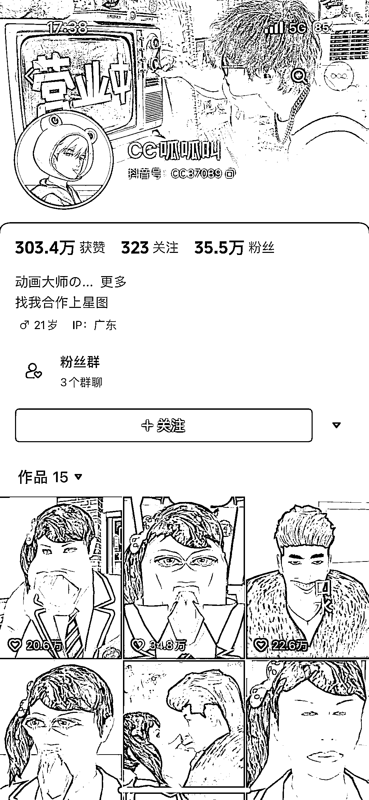
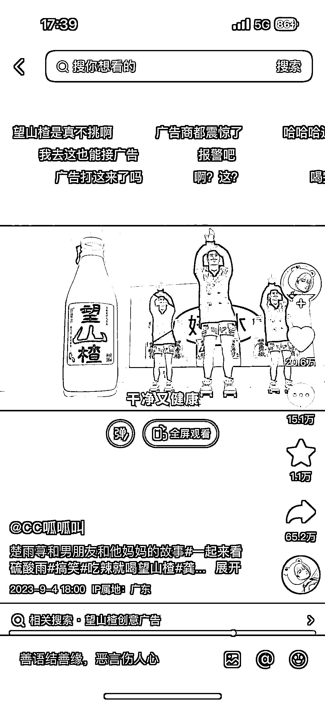

# 创新动画号《一起来看流星雨》，抽象鬼畜画面走红，广告无违和感

> 原文：[`www.yuque.com/for_lazy/xkrm14/xh33qvegy5fm84pb`](https://www.yuque.com/for_lazy/xkrm14/xh33qvegy5fm84pb)

作者： 百能

日期：2023-09-08

点赞数：**103**

* * *

正文：

一种形式很新的动画号。 内容是复刻经典电视剧《一起来看流星雨》，用的电视剧的原配音，但是画面内容是自己设计的，很抽象很鬼畜，都是几十万点赞。
几乎每条视频都有广告，而且毫无违和感。

* * *

评论区：

倪大胖 : 绝绝子哈哈哈

倪大胖 : 一些台词是原剧中没有的，但是声音却一样。咋做到的哦

* * *

公众号懒人找资源，懒人专属群分享