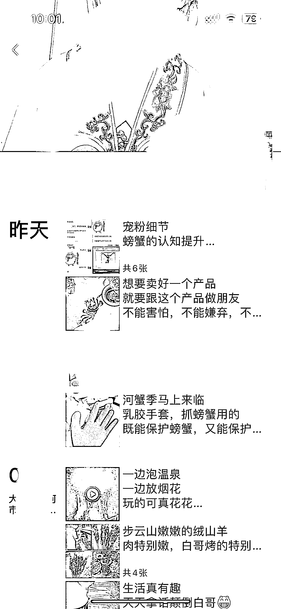

# 线下流量+微信私域，激发用户下单率，旅游业+本地特产案例分析

> 原文：[`www.yuque.com/for_lazy/xkrm14/zw1qhtiha12kp2zo`](https://www.yuque.com/for_lazy/xkrm14/zw1qhtiha12kp2zo)

作者： 三恒

日期：2023-09-05

点赞数：**57**

* * *

正文：

线下流量+微信私域重复激发用户下单率，手里微信号有 1w+用户的，可以尝试！ 参考航海：（线下流量服务+快团团私域）
当所有人都在谋求线上获取增量客户的时候，线下的客户源以及已有的私域客户就很容易被忽视，甚至放弃！ 案例：旅游业+本地特产，销量利润都非常客观！
观点、本质思维：一切商业的本质都在于价值的交换，而交换的主体是【人】
从这一点来看，不管你的用户是从哪儿来的？是因为什么原因加的你？但是他们都有最底层的欲望和需求去满足，马斯洛需求法则，物质是第一位，吃喝玩乐都是最底层的需求。
灵感来源于两个做旅游民宿的朋友，一个是东北大连、一个海南的，让我佩服的是他们都在自己的领域内做的很好，当然离不开【服务】和【真诚】，因为足够真实（这个真实是一个足够真实的人，有生活，有故事。而不是只有广告的限售），所以她们的私域触达用户的概率非常高，以至于每次他们朋友圈卖产品的时候我都会下单。
以东北大连的朋友为例，她每年的 2 月份开始到 6 月份,会卖大连樱桃，四月份买的时候我问了问，每天出货量在 60-80 箱左右，按我买的单价 5 斤/268 元算，60*268=16080，持续 3-4 个月，大家自己算算吧，就算扣除农户的费用，大几十万是有的，这还只是一个产品！
案例分析： 变现路径：旅游民宿+本地特产 用户：各个省份的用户都有，年龄在 26-45 岁居多、有消费能力。 目的：都是奔着同一个目标来的，本地特色旅游和食品。
需求：我不能天天来、月月来旅游，但是我有想吃想喝，你可以提供，我还剩了飞机票！
制造虚荣心：人人都有“被人羡慕”的虚荣心，如果这个吃的只有海南或者大连的最好，而且只有 2 个月能吃到。
这就是稀缺，用户会自发传播。例如海南的妃子笑荔枝、大连河蟹、樱桃等等，现在看来运营好的话复购率非常高！

* * *

评论区：

三恒 : 《失控》的作者，凯文.凯利提出了一个“1000 粉丝”理论；如果我们有 1000 个铁粉，每个人每年愿意为我的服务支付 1000 元，那我们很容易就能年收入 100 万以上了。
所以，我认为在存量经济时代，能够在自己的私域打磨好一款产品很重要，相比于你需要不停歇的去公域引流客户，然后完整这种类似【一次压榨式成交】的方式？
你可以看看你身边哪些真正的大佬正在做的事情！仔细观察他们最不一样的点是什么？

雅俊 : 666

* * *

公众号懒人找资源，懒人专属群分享