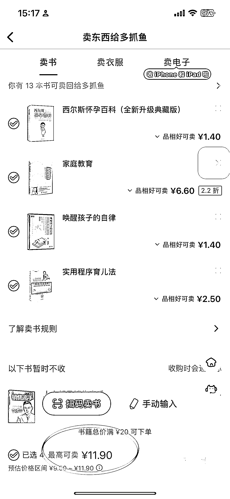
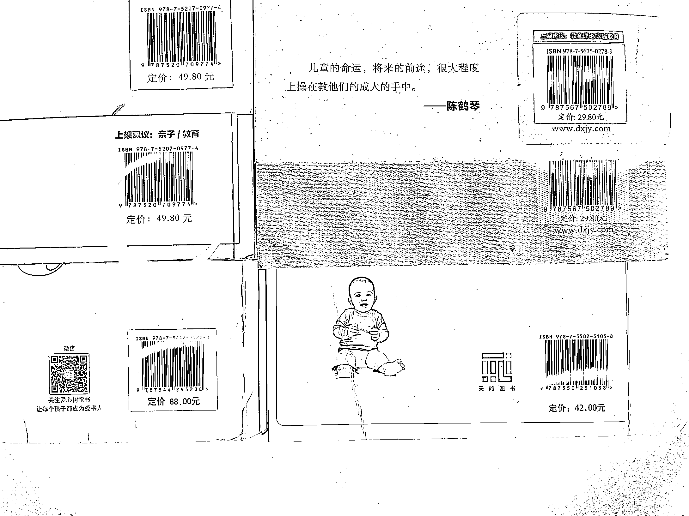

# 多抓鱼：二手书交易平台的高利润和壁垒

> 原文：[`www.yuque.com/for_lazy/xkrm14/stbxhkgabvgdketu`](https://www.yuque.com/for_lazy/xkrm14/stbxhkgabvgdketu)

作者： 认知小窗-认哥

日期：2023-09-04

点赞数：**64**

* * *

正文：

做二手书，还是很香的[奸笑] 图一是多抓鱼收书的价格，图二是书封底标价。 就算按照双十一，读书日这种活动的 5 折来算，
200*0.5=100，在新书此价格基础上，多爪鱼打个 5 折(不夸张吧)卖出， 依然有将近
500%的毛利，因为多抓鱼收书的价格，简直比北京的公交票还低，4 本书只能卖 11 块钱，
最夸张的《西尔斯怀孕百科》，标价 88，买的时候要等好久都没货，回收价只有 1.4[苦涩]
我第二次用多抓鱼，就判断这是一个流转租金平台，而不是表面的二手书商。 A 以原价 5 折买完了书，看完了多抓鱼上门以 5 折的 1 折免邮回收， 然后再次以
5 折卖给 B，并以此类推。 周转效率类似于饭店的翻台率，周转率越高，说明这类书畅销，边际成本就越低。 他们后开展的衣服，手机，ipad 也是同理。
那壁垒在哪里？ 一是推广介绍，类似于卫龙辣条的俏皮公众号风，活泼不紧绷，再加上出位的名义和 logo，很抓文艺青年的心。 二是客户对价格不敏感，且粘性高。
前阵子看过拍卖旧二手书的，如果能够借鉴多抓鱼和 A 妹财经这类话术，应该能做的不错。

* * *

评论区：

认知小窗-认哥 : 多谢亦仁大大翻牌！

张达达 : A 妹财经是小 A？

倪大胖 : 请问 a 妹财经是指？

认知小窗-认哥 : 抖音号全名：小 A 学财经，800w 粉

认知小窗-认哥 : 没错

* * *

公众号懒人找资源，懒人专属群分享