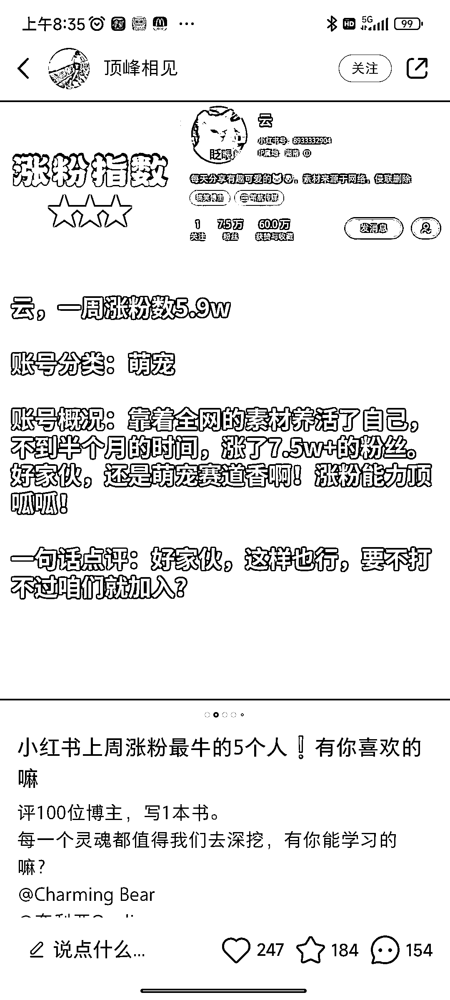

# 小红书每周涨粉最多的 5 个人，教你轻松找到博主并蹭热度

> 原文：[`www.yuque.com/for_lazy/xkrm14/xvse53h6w4gal9db`](https://www.yuque.com/for_lazy/xkrm14/xvse53h6w4gal9db)

作者： 白菜

日期：2023-09-13

点赞数：**101**

* * *

正文：

小红书收集整理每周涨粉最多的 5 个人，12 条笔记千粉，观众都是想做小红书的人。
做这个号用第三方平台可以轻松找到这些博主，难度低，永远不缺内容，还能蹭热度，本身也可以挖掘到很多暴涨粉的账号，一举多得。
践行“万物不为我所有，万物皆为我所用。”

* * *

评论区：

蓝弈 : 这至少是月入破万的小生意啊[奸笑]

Linda Wang : 我没看明白，怎么变现呀，接广告吗

三金 : 哇，周报告，月 100 名，私聊，卖数据工具

蓝弈 : 参考行业信息差，可以做付费资料、社群、账号账号诊断、课程分销等等[偷笑]

* * *

公众号懒人找资源，懒人专属群分享