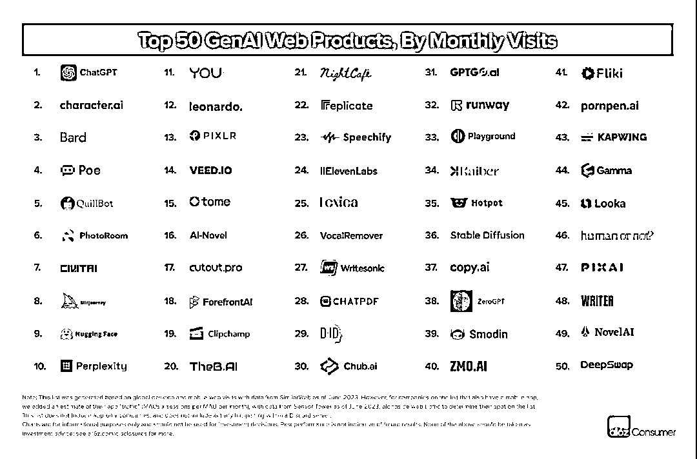
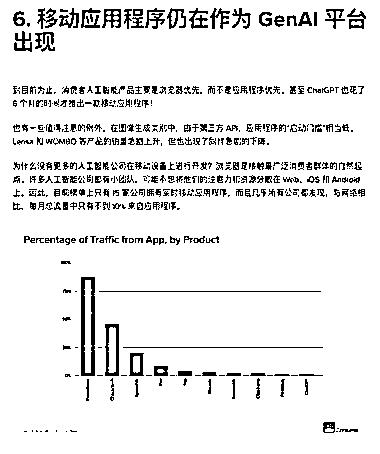
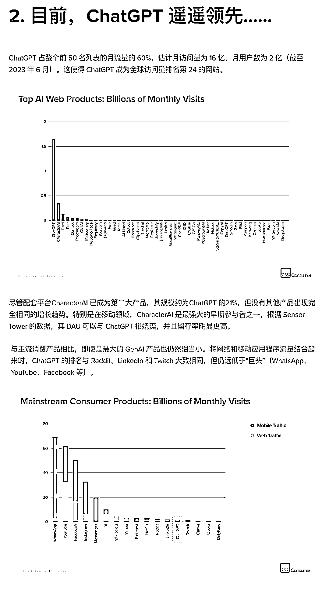
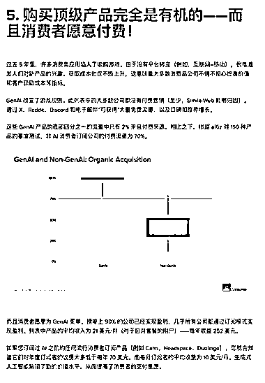
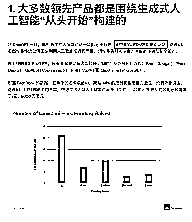

# A16Z 调查报告揭示：AI 类产品适合小团队创业，用户付费意愿极强

> 原文：[`www.yuque.com/for_lazy/xkrm14/cidgbwc4nvlnldls`](https://www.yuque.com/for_lazy/xkrm14/cidgbwc4nvlnldls)

作者： 哥飞

日期：2023-09-14

点赞数：**98**

* * *

正文：

A16Z 这篇调查报告 ，我用谷歌翻译搞了个中文版本，分享给大家。 一些有意思的点：
1、到目前为止，大多数 AI 类产品形态都是以网站为主，只有 15 家有手机 App；
2、大多数 AI 类产品都是基于 AI 能力从零开始开发的，与 ChatGPT 一样，列表的大多数产品在一年前还不存在；
3、48%的团队是自力更生，没有拿外部投资，这说明做 AI 类产品可以用小资源撬动大量用户； 4、15%的产品拿到了超过 5000 万美元的投资；
5、ChatGPT 遥遥领先； 6、图像生成领域的早期赢家已经出现，那就是 MidJourney； 7、本文由哥飞基于谷歌翻译给大家整理；
8、以前的互联网产品靠烧钱打广告获取用户，AI 类产品靠口口相传获得新用户；
9、用户很愿意为 AI 类产品付费，名单里 90%的公司已经实现盈利，几乎所有盈利公司的盈利都来自于用户订阅贡献；
10、AI 类产品订阅者平均月费为 10 美元，而非 AI 类产品年付 70 美元就已经挺高了。
哥飞总结一下，AI 类产品很适合小团队创业，不需要太高的门槛，也先不要去开发 App 了，做个网站就可以开始赚钱。
获取用户的成本极低，但用户付费意愿极强。[How+Are+Consumers+Using+Generative+AI?+|+Andreesse...](https://a16z.com/how-are-consumers-using-generative-ai/) 

* * *

评论区：

强哥手记 : 感谢翻译呀

melisa : 不错的分析

念念无住 : 就很受激励

* * *

公众号懒人找资源，懒人专属群分享