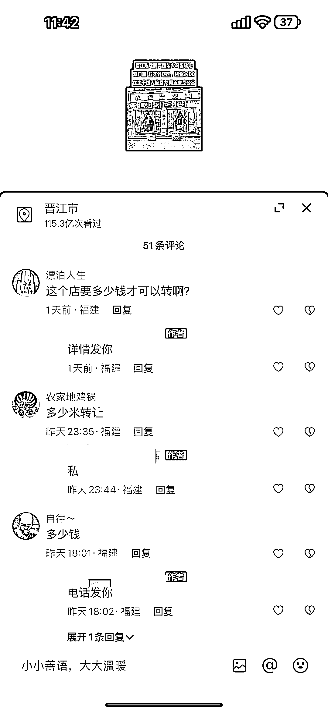

# 抖音成为店铺转让的新渠道

> 原文：[`www.yuque.com/for_lazy/xkrm14/fhst0590kbg6oo7c`](https://www.yuque.com/for_lazy/xkrm14/fhst0590kbg6oo7c)

作者： 斑马森林

日期：2023-09-15

点赞数：**81**

* * *

正文：

说到转让店铺，通常你会想到哪些渠道？
任何生意都可以在抖音上尝试做一遍，这是我们本地的一个账号，有人在抖音上通过发布店铺转让信息，做店铺转让生意，一方面收取店铺转让费，另一方面，还提供店面装修，设备采购等服务，同时，手上也拥有一群本地的商铺老板信息

* * *

评论区：

赵半山 : 这个要企业认证后才能发联系方式才有意义

餐饮供应链小祥哥 : 这个抖音名字叫啥

Jason wey : 已经是半蓝了

小白脸 : 信息流业务

* * *

公众号懒人找资源，懒人专属群分享