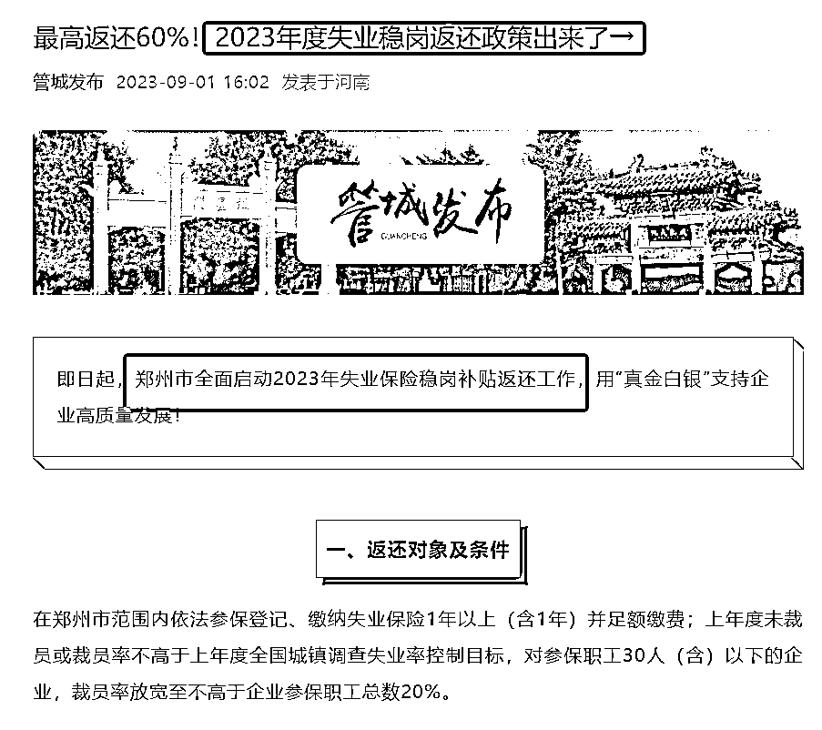
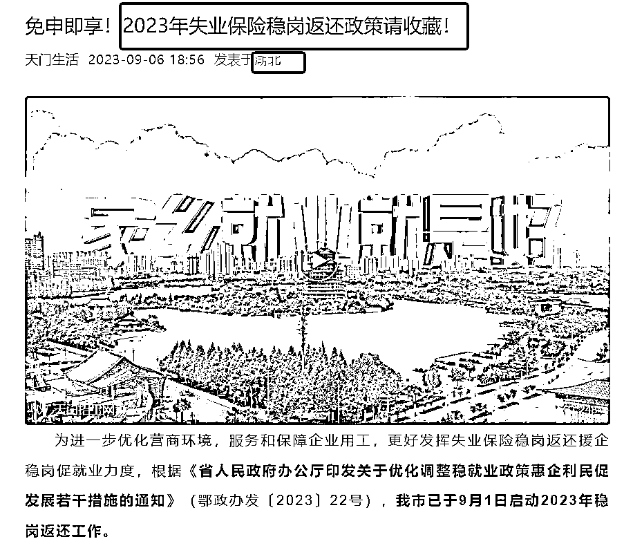
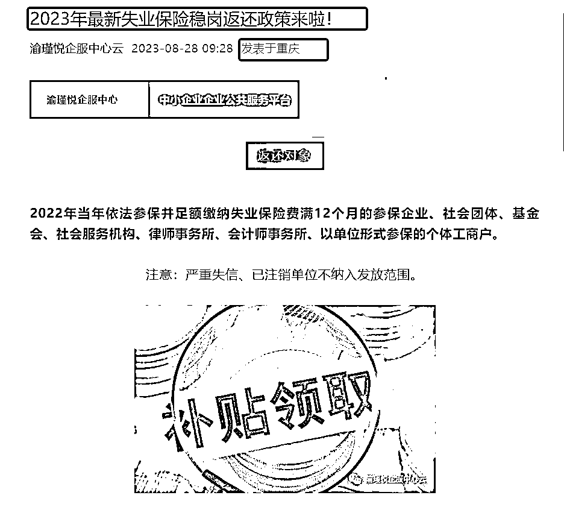

# 各地区退出《2023 年度失业保险稳岗返还》政策，潜在机会浮现

> 原文：[`www.yuque.com/for_lazy/xkrm14/ks2m8s99mn3mioxk`](https://www.yuque.com/for_lazy/xkrm14/ks2m8s99mn3mioxk)

作者： 多米杨

日期：2023-09-15

点赞数：**86**

* * *

正文：

最近，各个地区陆续退出了《2023 年度失业保险稳岗返还 》政策， 各个地区，流程不一样，
涉及参保企业、社会团体、基金会、社会服务机构、律师事务所、会计师事务所、以单位形式参保的个体工商户； 潜在机会： 1、做一个
各个省的政策及申请流程汇总，在自己的社交媒体号发布； 2、可以为自己的社交媒体账号引流； 3、潜在的企业项目合作机会；

* * *

评论区：

* * *

公众号懒人找资源，懒人专属群分享