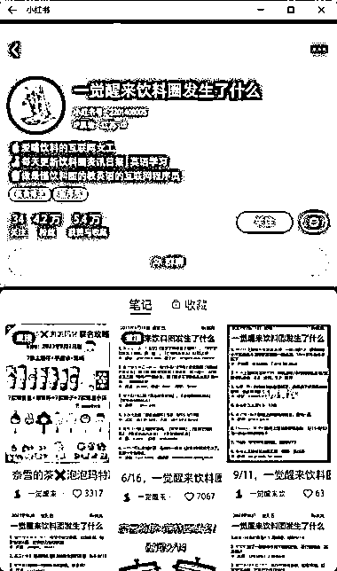

# 跨界 IP 账号成功结合饮料和学英语，变现简单安全

> 原文：[`www.yuque.com/for_lazy/xkrm14/dduqbhvo77wmexoz`](https://www.yuque.com/for_lazy/xkrm14/dduqbhvo77wmexoz)

作者： 许山山

日期：2023-09-11

点赞数：**84**

* * *

正文：

一觉醒来系列依然可以做，IP 人设+小众垂直领域+跨界。比如下面这个账号把【饮料届】的信息差和【学英语】结合起来了。变现也直接，接奶茶店的广子即可。还有这个账号很安全，感觉炸号的风险极低...

* * *

评论区：

希声 : 有意思

许山山 : 😄

melisa : 怎么跟英语结合起来

许山山 : 你看她笔记里每一篇都在学单词

阿晴 : 微博看到有人做同城，长沙信息差。可以接商广私单，私域。

许山山 : 形式差不多啦，早期有类似一觉醒来哪里怎么怎么了的账号

阿晴 : 个人感觉能用视频号或者公众号接私域更快。

* * *

公众号懒人找资源，懒人专属群分享