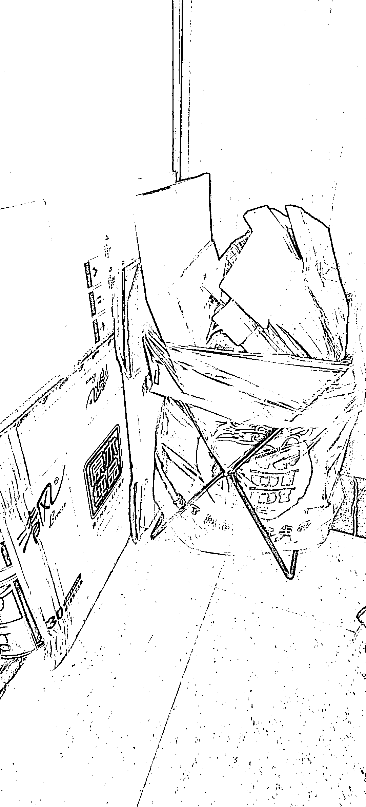

# 小区垃圾回收服务创新，实现三赢局面

> 原文：[`www.yuque.com/for_lazy/xkrm14/goy8k2niay1ptihp`](https://www.yuque.com/for_lazy/xkrm14/goy8k2niay1ptihp)

作者： vincent

日期：2023-09-12

点赞数：**94**

* * *

正文：

瞧瞧收垃圾的这个服务与意识。
最近楼下收垃圾的，给我们小区每户都配了一个盛放纸盒的架子和垃圾袋。这样我们每家每户把可以卖的垃圾都放在这个袋子里。然后收垃圾的人会定期过来回收。
达到了三赢的局面。业主随手积累，可以卖点钱。垃圾收集更整洁了，不给物业带来麻烦。回收纸盒垄断了我们小区。

* * *

评论区：

坏孩（大学生） : 意思是你们放到门口，然后收废品师傅上门来收，然后还会给你们每一户发钱吗

vincent : 是的。

张乐乐 : 这个袋子里会放生活垃圾？

vincent : 不放生活垃圾，放的是可以回收的垃圾。纸箱，瓶子之类的。

蓝弈 : 思路不错，赚一个中间商差价

胡二虎🐯 : 不好管理。容易被婆婆们截胡

vincent : 不需要管理，婆婆们截胡自然有户主关注，户主如果不关注，回收纸箱的人也无所谓的，婆婆们最后也是会卖到回收站的。

* * *

公众号懒人找资源，懒人专属群分享