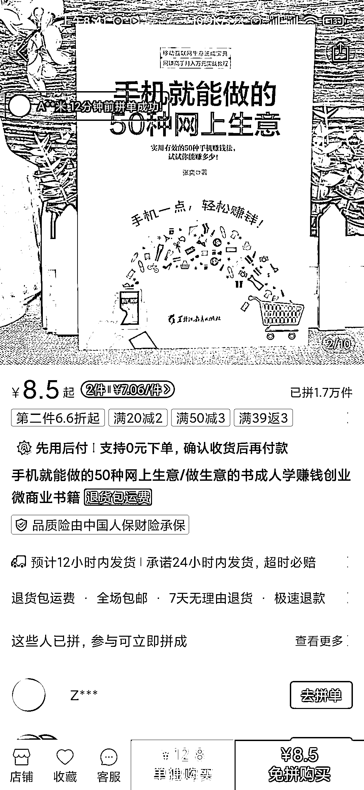

# 《手机上就能赚钱的 50 种方式》在拼多多上销售火爆，但成本如何？

> 原文：[`www.yuque.com/for_lazy/xkrm14/ebukaygt7pbgfc5g`](https://www.yuque.com/for_lazy/xkrm14/ebukaygt7pbgfc5g)

作者： 刘卡卡

日期：2023-09-14

点赞数：**92**

* * *

正文：

书籍 《手机上就能赚钱的 50 种方式》 这种书籍在 pdd 竟然卖的还很不错，感觉用个一周时间就能写一本出来 就是不知道成本上怎么样，没啥经验

* * *

评论区：

海阔天空 : 关键是能不能落地实操[微笑]

小魏从 0 开始做副业 : 能不能落地实操不是关键把，有人买就好了

理想桃🍑 : 我们是卖书的…不是买书的

航哥 : 买书是刚需，而非读书，不要去读，不要去买，去卖，厚颜无耻大喊大叫的去卖就好了，世界属于不要脸的人

航哥 : 凡事先卖再说，其次都是其次

海阔天空 : [捂脸]

胖大魔 : ！！！

* * *

公众号懒人找资源，懒人专属群分享