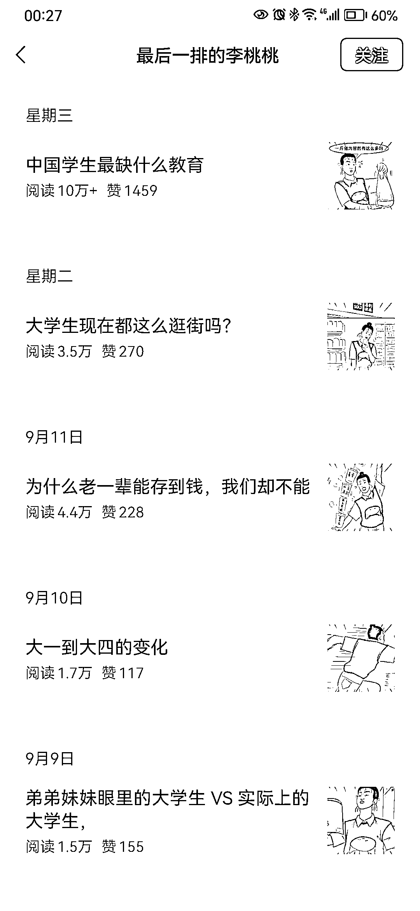
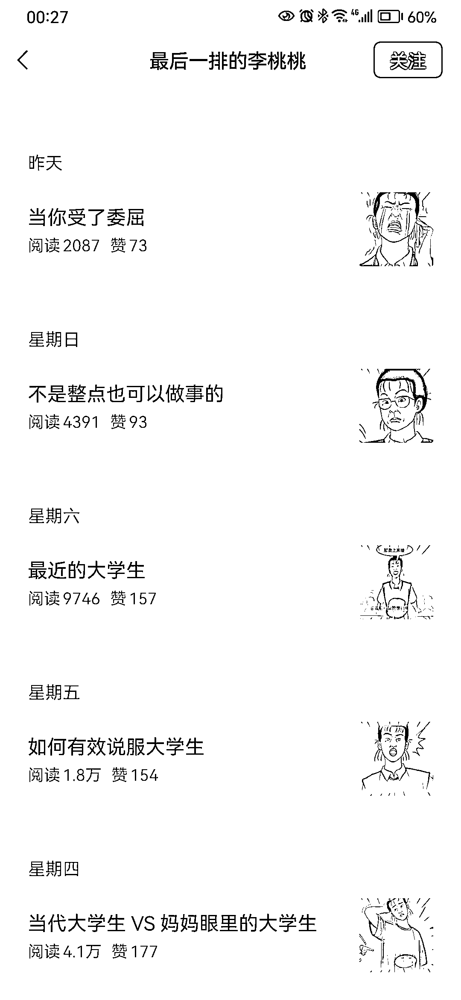

# 用漫画和 AI 创作，公众号爆文双重收益

> 原文：[`www.yuque.com/for_lazy/xkrm14/ivgg2nu03a1ony2t`](https://www.yuque.com/for_lazy/xkrm14/ivgg2nu03a1ony2t)

作者： 林。

日期：2023-09-19

点赞数：**92**

* * *

正文：

用漫画做公众号爆文，吸粉创作，双重收益 公众号一直有推荐池，垂直领域持续日更能进池，这是今年 7 月 18 日注册的，原创 79 篇，出过 10 万爆款
漫画可以用 Ai 来画，故事可以交给 Ai 来写，我看图片很简单、每篇只有 5 张图片而已。

* * *

评论区：

better me : 漫画是哪个软件呀

牧言木语 : AI 绘画吗？

财火 : 这个像是自己画的

李治国 : 同问 AI 绘画用那个软件呀？画这种动漫形式的

林。 : 感谢亦仁老大，首次中标，很激动！

南斋读书 : 大佬，这种漫画怎么画？

霖子 : 软件画，上面这种像是自己画的，因为上面的纹理不均匀

* * *

公众号懒人找资源，懒人专属群分享