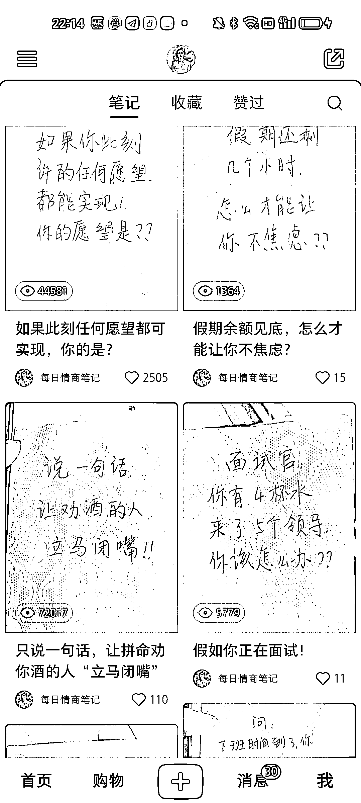

# 小红书每日情商笔记，流量爆棚，点赞留言疯狂，但涨粉率待优化

> 原文：[`www.yuque.com/for_lazy/xkrm14/ozqw4cgd6ykl1ikb`](https://www.yuque.com/for_lazy/xkrm14/ozqw4cgd6ykl1ikb)

作者： 老船长李阳

日期：2023-10-08

点赞数：**109**

* * *

正文：

最近测试了小红书，这种做号方式。 项目名称: 每日情商笔记 做法: 那一张纸在上面写一个关于情感或者职场遇到的比较敏感的问题。然后提问让网友来回答。
这个做法的流量超级大，可以看到我发的第一条观看量已经到了十几万。 其他的也都在几万，最少的也大几千。 点赞和留言永远都是 99+ 变现模式: 1.小红书广告
2.带货卖书 3.导流私域，开发其他产品 存在的问题: 据我测试观察，这种内容的点赞和留言非常疯狂，但是涨粉率不高。也是后期需要优化的点，大家可以支支招！

* * *

评论区：

Mr.Mcphist : 我也看到了不少，只是好奇变现方式是什么？

W.Z.Y : 卖账号

子云师兄 : 做情感私域不错

一诺 : 后边加上某某情商课的答案

帅帅🔫🌱 : [强][强]还是转化到知识付费

晨宇 : 看主页，接了不少的商单

老船长李阳 : 结合@子云师兄@一诺的想法，做情感类内容，后面加上某机构的推荐答案。这样可以导流做情感了！

* * *

