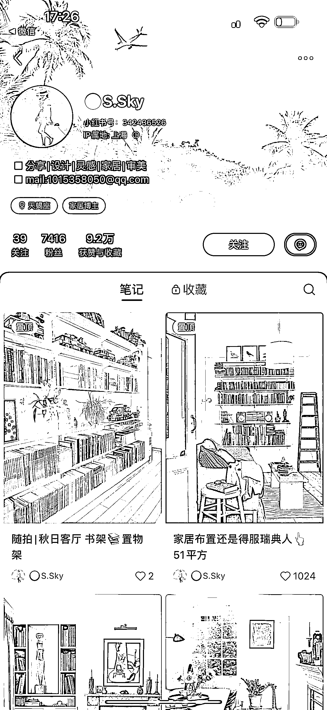

# 可复制的小红书玩法：家居家装号+搬运国外 ins 图，

> 原文：[`www.yuque.com/for_lazy/xkrm14/yzn8xfgzlywg2xm5`](https://www.yuque.com/for_lazy/xkrm14/yzn8xfgzlywg2xm5)

作者： 蔡文静好文静

日期：2023-10-10

点赞数：**102**

* * *

正文：

可复制的小红书玩法：家居家装号+搬运国外 ins 图。涨粉近 7500 人 内容玩法：
1、内容搬运参考来源：国外 ins、国内家居 app（好好住等），搬运精致好看的各类家居风格图片，涨粉
2、标题关键词：家居家装风格（中古、现代风、北欧风等）、xx 国家室内设计师、蹭影视剧家居场景等 3、正文内容：简单一两句。#话题 引流方式：
个人简介上，写了自己的邮箱便于联系接广 变现方式： 1、目前：接家居广告、线下探店家具厂广告等
2、未来还可以笔记带货家居好物产品、改造装修自家房屋转 ip 人设

* * *

评论区：

屈伸 : 搬 ins 的 会侵权吗

龙辰 : 任何行动都有风险

蔡文静好文静 : 谢谢亦仁老师~

* * *

