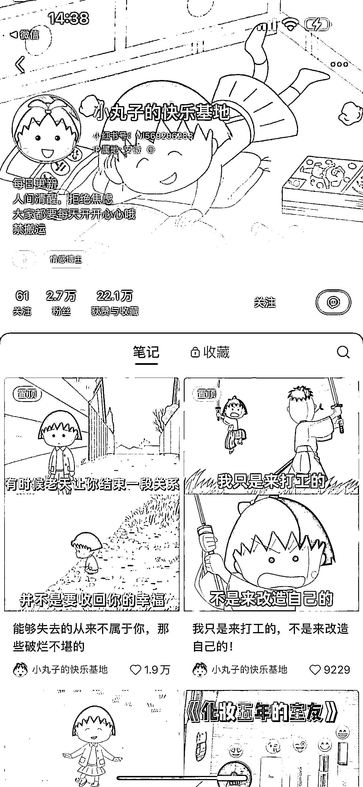
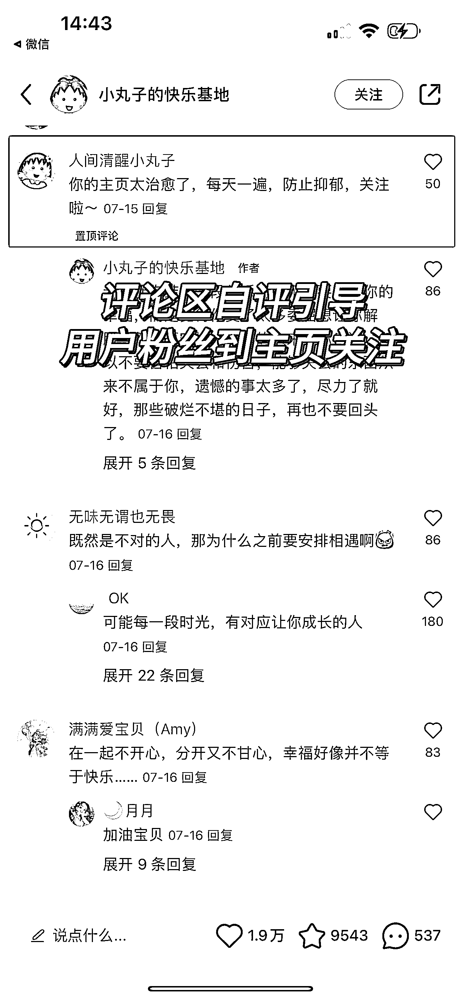

# 可复制的小红书玩法：热门影视剧+电影字幕，月收入可达一万多两万！

> 原文：[`www.yuque.com/for_lazy/xkrm14/toepx0vhrxekxm6r`](https://www.yuque.com/for_lazy/xkrm14/toepx0vhrxekxm6r)

作者： 蔡文静好文静

日期：2023-10-11

点赞数：**96**

* * *

正文：

可复制的小红书玩法：热门影视剧（樱桃小丸子）+电影字幕
粉丝 2.7w，广告报价预估一两千单篇。统计过一个月已接广告大概 15 篇左右，预计单月收入可达一万多两万！ 内容玩法：
1、底图制作来源：底图可以上百度直接搜，或者影视剧截屏 然后用黄油相机或醒图，加上白色字体字幕
2、文字内容来源：讲情感话题、个人成长话题、鸡汤文等。都是网络搜索改变 3、决定吸引到的粉丝画像，可以延伸做女性护肤美妆护理、家居等产品的广告
4、评论区自评引导：用户粉丝到主页关注 变现方式： 1、接商业广告为主（女性） 2、未来可以跟心理情感身心灵等产品，做引流二次合作

* * *

评论区：

Nafrua : 广告报价没有那么高

肥仔梁 : 解决了素材问题

阿润 : 后台报价 200 多，30 天 10 多个，广告费几千吧。后期转身心灵倒是不错的选择

IT 可乐 : 请问这个素材哪里有整理好的嘛？可以付费

肥仔梁 : 这个我不清楚，不好意思

* * *

