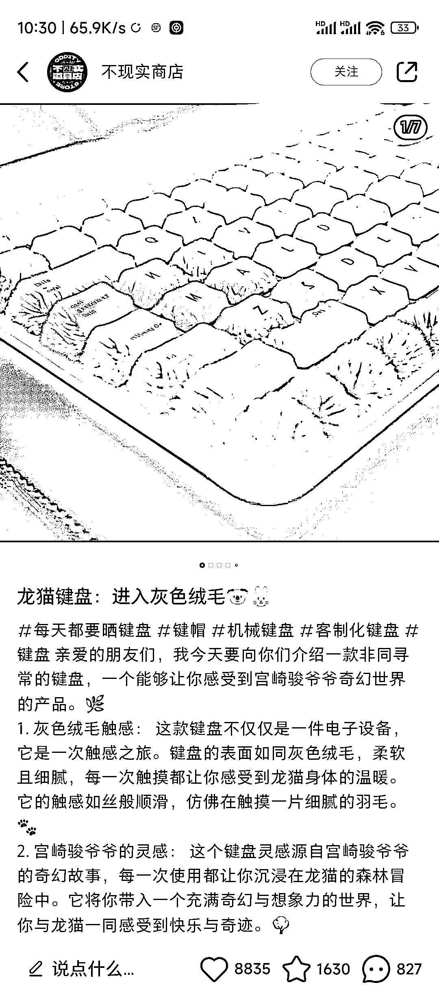
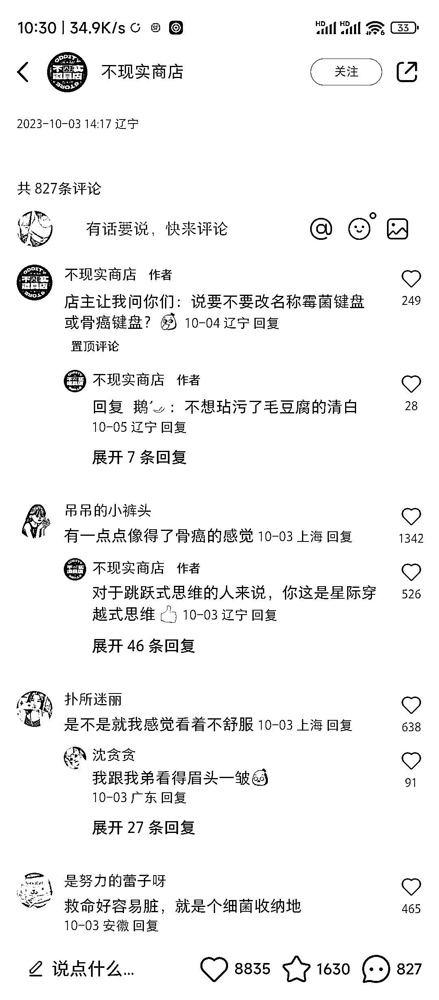
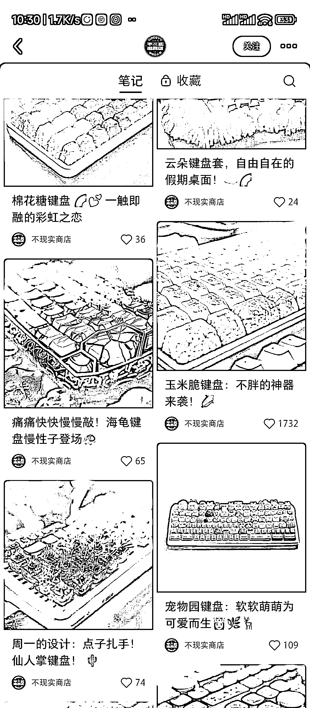
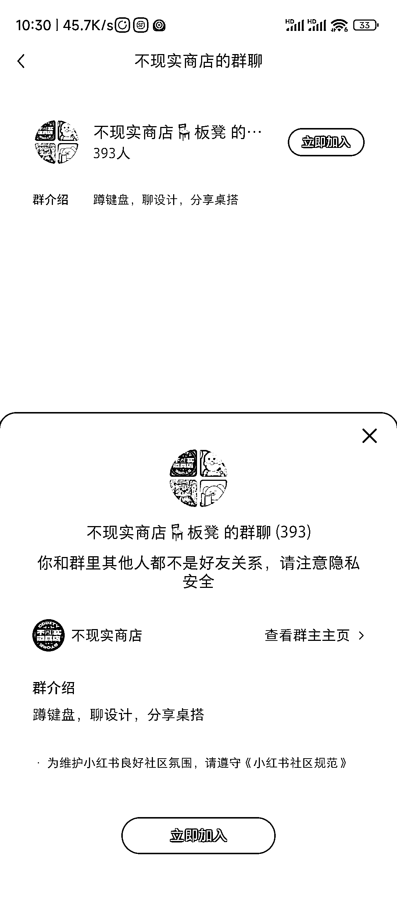

# 小红书热门博主分享有趣键盘绘画，引发讨论热潮

> 原文：[`www.yuque.com/for_lazy/xkrm14/ocuzyakcbs5od6up`](https://www.yuque.com/for_lazy/xkrm14/ocuzyakcbs5od6up)

作者： 浮夕

日期：2023-10-12

点赞数：**77**

* * *

正文：

刚刚小红书刷到的一个博主，他用
al 绘画一些风格有趣的键盘，和一些相关的配件，目前来看键盘感觉话题量和讨论量比较大，应该和大家上班打字，玩手机打字经常用到有关，一个发了 86
篇笔记，有一个群聊 393 人，看来还是挺多人喜欢这样的内容

* * *

评论区：

是十三幺啊 : 客制化键盘确实是个不算特别大众但是非常稳定的圈子。和玩耳机、玩音响这种一样，也是养成系列。像这种键盘外观定制的拥趸也不在少数。先圈人头聚集共同爱好者，后期根据这个方向，很大概率可以变现。

艾小飞 : 刚看了，评论区需求量产呼声很高

浮夕 : 这行动力可以[强]

林元陸 : AI 绘画自媒体的航海项目可以参考这个案例了哈哈哈

* * *

