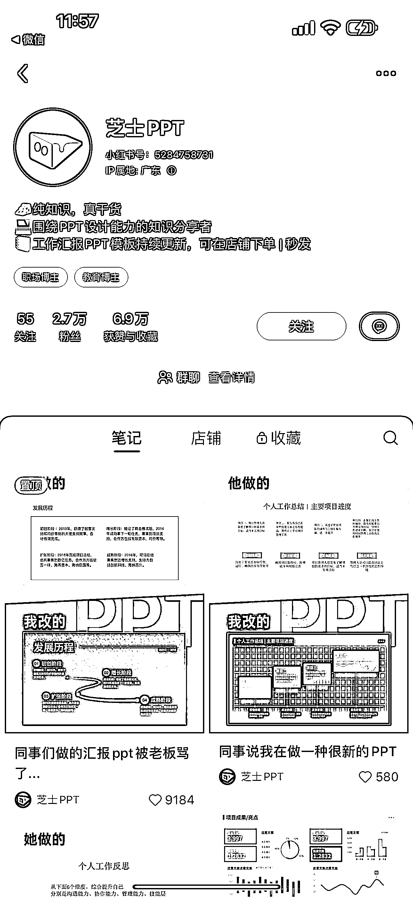

# 可复制的小红书玩法：产品效果前后对比玩法（可视化对比）

> 原文：[`www.yuque.com/for_lazy/xkrm14/bpvd934dks3084kq`](https://www.yuque.com/for_lazy/xkrm14/bpvd934dks3084kq)

作者： 蔡文静好文静

日期：2023-10-13

点赞数：**90**

* * *

正文：

可复制的小红书玩法：产品效果前后对比玩法（可视化对比）
31 篇笔记涨粉 2.7 万，单店销售 ppt 模板店铺销量 30 万+，超过千个客户下单！爆款更是很值得大家参考的产品类-客户案例展示的笔记 内容玩法：
1、封面图形式采用：同事她做的 vs 我做的。对比效果显而易见，用户更能感受到美感和高级感
2、标题围绕职场人关心的关键词：工作总结、年终总结、工作计划、被领导夸爆 3、单账号里，不断重复复用爆款模板：同事她做的 vs 我做的
爆款内容，还可以复用到矩阵号里：有 5 个矩阵号 引流钩子： 评论区自评话术：消息太多回不过来了我会把模板放在裙里，宝子们点左下角自取哈 变现方式：
1、直接在小红书店铺电商售卖模版做变现 2、接商业广告 3、引流私域，做 ppt 技能培训，及职场技能周边均可

* * *

评论区：

艾小飞 : 思路很棒

* * *

