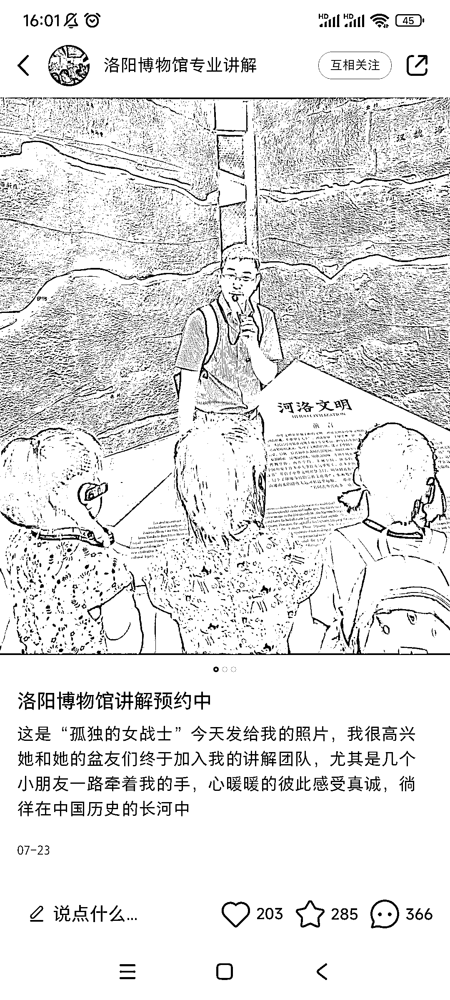
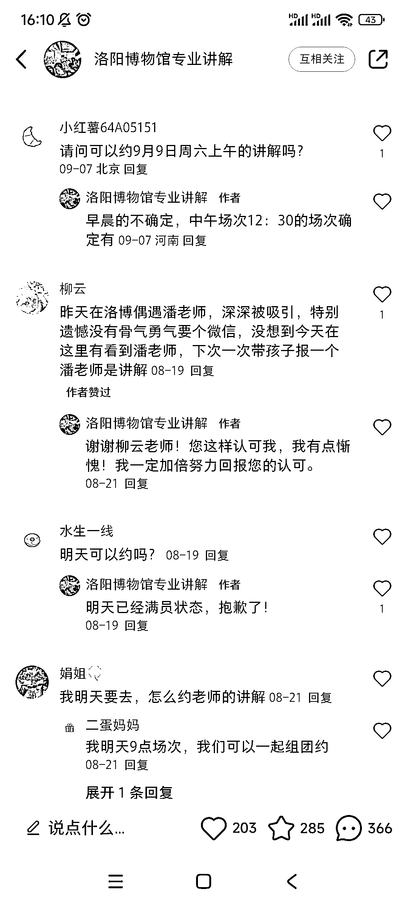
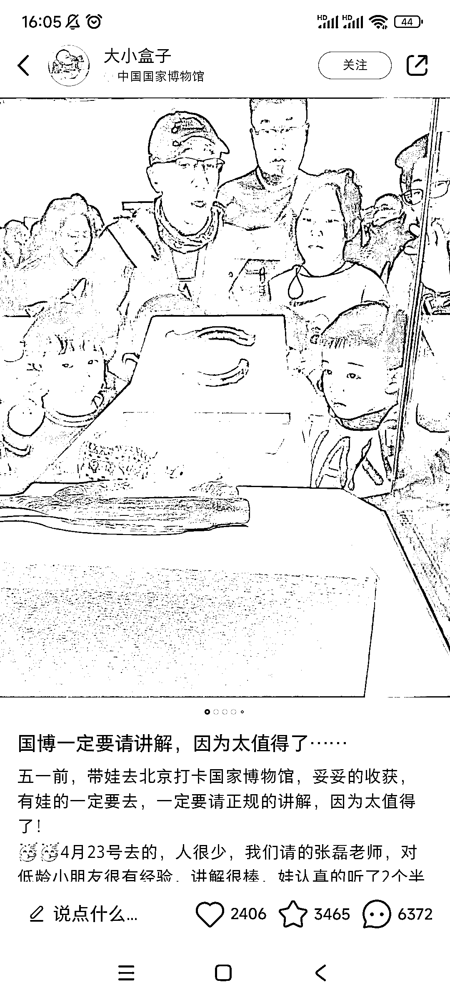

# 小红书成为导游需求的热门平台，国庆布局机会大

> 原文：[`www.yuque.com/for_lazy/xkrm14/gma68o0qqkvdgiyb`](https://www.yuque.com/for_lazy/xkrm14/gma68o0qqkvdgiyb)

作者： 阿黎

日期：2023-09-25

点赞数：**48**

* * *

正文：

小红书上请导游有很大需求，很多人都在小红书找导游，比携程、飞猪、天猫更多，国庆临近，可抓紧布局
这两篇笔记，都是简单粗暴发的讲解现场展示、客户反馈，不涉及任何知识分享，就有很多询单 异常值:评论高于赞藏，全部是怎么约，多少钱

* * *

评论区：

better me : 真的需求很大 引流很顺利 就是变现好难 几周了 我还没聊成功 说完价格就没下文了[撇嘴]

HDDD : 太贵了？

better me : 嗯嗯 然后各种比价去了

* * *

