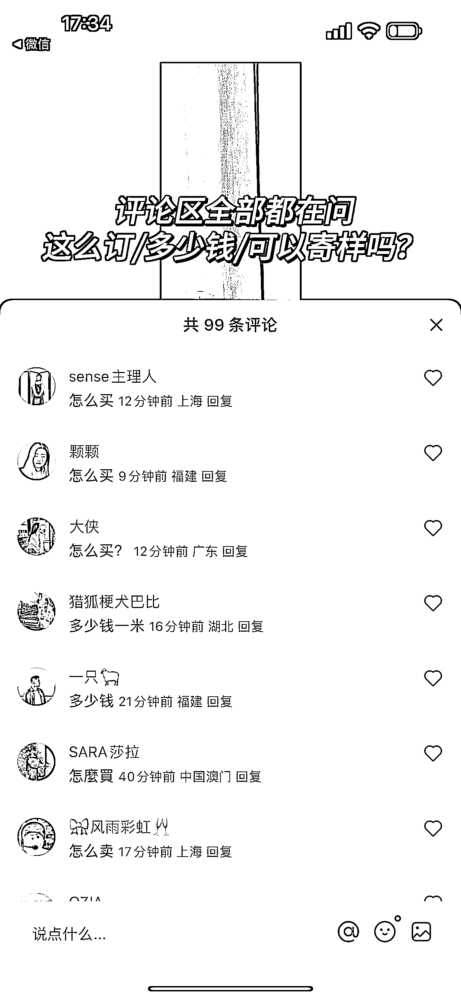
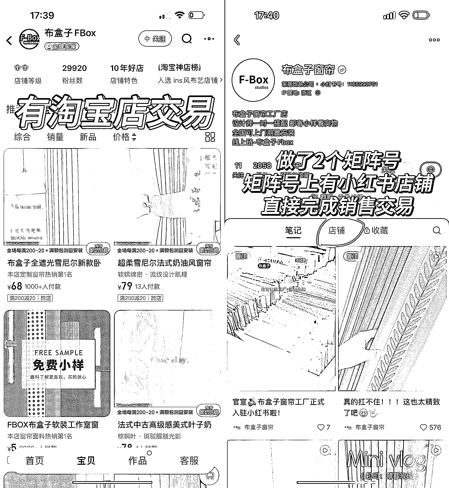

# 可复制的小红书玩法：家居好物 x 复用爆款短视频节奏

> 原文：[`www.yuque.com/for_lazy/xkrm14/mg1m3vts0ktddymt`](https://www.yuque.com/for_lazy/xkrm14/mg1m3vts0ktddymt)

作者： 蔡文静好文静

日期：2023-10-12

点赞数：**45**

* * *

正文：

可复制的小红书玩法：家居好物 x 复用爆款短视频节奏（同角度实拍分享）
不断复用爆款的固定场景拍摄，109 篇笔记，粉丝 2.9w。评论区全部都是问怎么订/多少钱/可以寄样吗… 内容玩法：
1、固定的场景拍摄：内容基本都是同一场景拍摄，视觉上展示出窗帘产品的质量质感，配上简单舒缓 BGM，用文字展现卖点（最大限度展现美）
2、标题关键词会蹭：热搜词（比如：奶油中古、美拉德等）、高级感、审美 3、企业号，可以直接私信发购买方式（线下上门或者淘宝店铺），和微信号。定制专属感更强
4、做了 2 个矩阵号。矩阵号上有小红书店铺，直接完成销售交易 变现方式： 1、置顶笔记帖子，接窗帘定制，主要引流线下店和淘宝店。次之小红书店铺电商交易

* * *

评论区：

* * *

