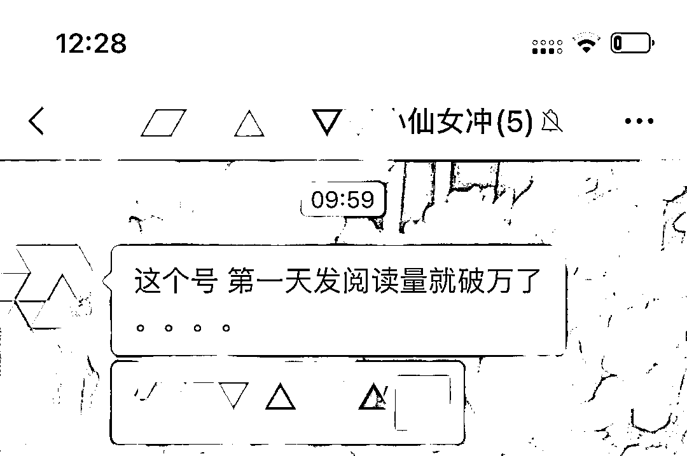

# 公众号同平台搬运玩法，一天 100 篇存货没问题！

> 原文：[`www.yuque.com/for_lazy/xkrm14/zc31u5dkuot6uqmo`](https://www.yuque.com/for_lazy/xkrm14/zc31u5dkuot6uqmo)

作者： 榛子（小梦）

日期：2023-09-26

点赞数：**159**

* * *

正文：

公众号流量主项目纯搬运玩法～ 如果说上次分享的纯图玩法是跨平台搬运，那么这次的分享便是公众号同平台搬运的玩法，一天搞个 100 篇存货没问题～
以早安晚安为例，找一个早安晚安图文祝福号，保存其图片，然后从里面任意复制一段话，就能搞定一条纯图更新～ 抛砖引玉～有闲号的想偷懒可以试试
大家可以举一反三：名人名言、美女、旅游、娱乐热点… （图一：随意找的号举例用；图二图三 ：一起玩的姐妹根据提示
，刚注册的小号第一天推送数据就破万了，正反馈很快～）

* * *

评论区：

文恕 : 请问这个方式通过流量主的方式变现么？

墨北 : 请问这个是公众号还是视频号？

榛子（小梦） : 对，另外 在电脑上操作可以挂个商品链接

榛子（小梦） : 公众号

夏俊虎 : 请问找的对标账号是在小红书找吗？

翱翔蓝天 : 这个不能标原创吧

小王 : 我标原创 总是被限制，现在还在封原创中[呲牙]

* * *

公众号懒人找资源，懒人专属群分享