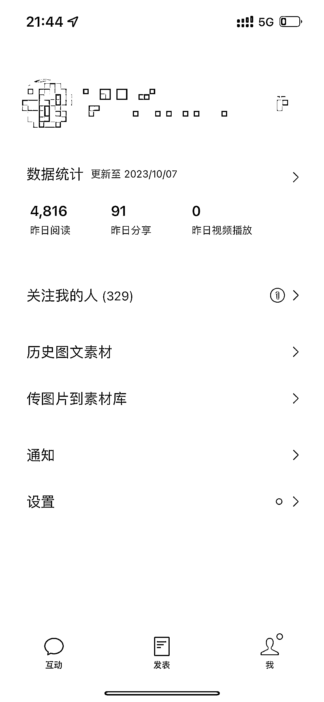

# 公众号引流效果超越抖音和小红书，浏览量和私域进入量比例惊人

> 原文：[`www.yuque.com/for_lazy/xkrm14/uabsqp5qclgcb3ps`](https://www.yuque.com/for_lazy/xkrm14/uabsqp5qclgcb3ps)

作者： 小夏有办法

日期：2023-10-09

点赞数：**98**

* * *

正文：

公众号引流好香啊 这比抖音和小红书好的太多了 浏览量和私域进入量的比例是 100：1 每天 2000 左右浏览，私域进入量是 20 左右
单日浏览量 4000 左右，私域进入量是 40 左右 已经稳定 14 天了 累计引流 300➕

* * *

评论区：

小夏有办法 : 感谢亦仁大大

小孙 : 大大 公众号怎么引流的

微婚高郡🇨🇳 : 怎么引流的是关键啊

小夏有办法 : 直接公众号文章内埋钩子，标题要足够吸引人，围绕自己的目标用户群体来

小夏有办法 : 每天写公众号文章，围绕目标用户群体，文章内埋钩子

小夏有办法 : 看你也是山东的圈友，感兴趣可以➕vx 具体交流，x07921921(备注生财)

元宵 : SEO 吗

* * *

公众号懒人找资源，懒人专属群分享