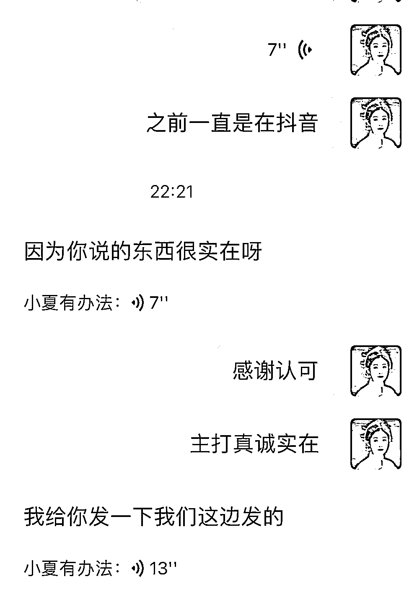
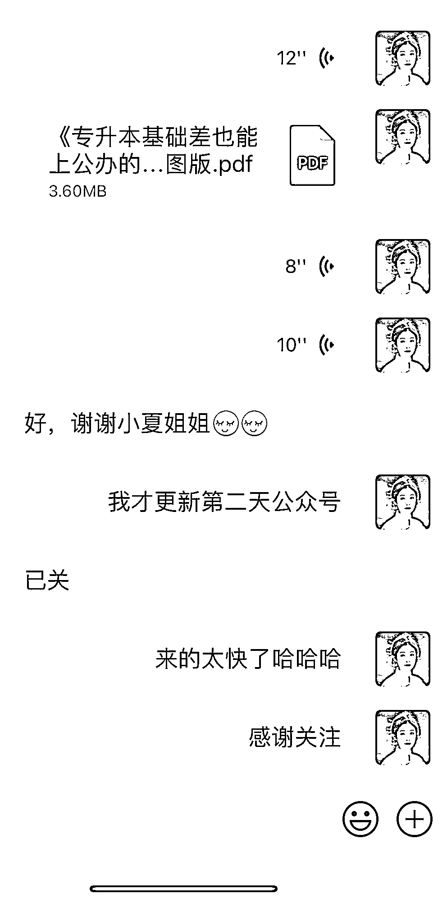

# 公众号流量递增，专升本市场潜力巨大

> 原文：[`www.yuque.com/for_lazy/xkrm14/ye8eu2xrt7zseecf`](https://www.yuque.com/for_lazy/xkrm14/ye8eu2xrt7zseecf)

作者： 小夏有办法

日期：2023-09-26

点赞数：**105**

* * *

正文：

公众号流量真的很不错 昨晚半夜两点随机写了一篇 今天加了 12 个专升本学生 我是做专升本市场的 都在卷抖音/小红书的时候 也别忽视公众号 流量也很香
目前数据还在递增 刚发现还有两个要加我的 发布不到 24 小时，14 个学生主动添加我

* * *

评论区：

教育圈-斯蒂芬周 : 想看！

小夏有办法 : x07921921 备注生财[呲牙]

认知小窗-认哥 : 斯蒂芬公众号，是您运营的吗

小夏有办法 : 已经引流 300 人[呲牙]公众号太香了吧

* * *

公众号懒人找资源，懒人专属群分享