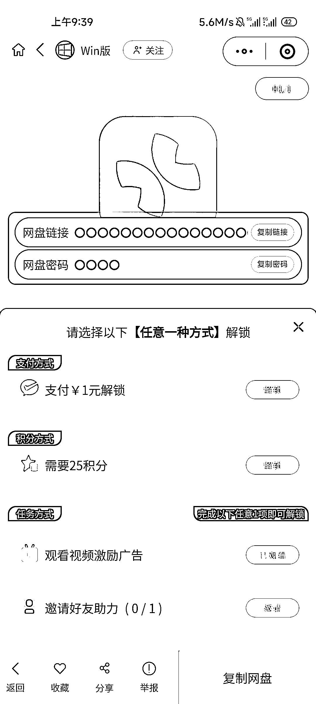

# 公众号资源分享圈友，尝试小程序分享方式，收益多多

> 原文：[`www.yuque.com/for_lazy/xkrm14/vievmbxgcbt8bhig`](https://www.yuque.com/for_lazy/xkrm14/vievmbxgcbt8bhig)

作者： 亿安

日期：2023-10-12

点赞数：**91**

* * *

正文：

做公众号资源分享的圈友，可以试试小程序分享的方式。 别人要拿资源，有三种选择 1.花一块钱 2.看一段 30 秒广告 3.邀请一个好友
不管怎么样，都是能够有收益的，再也不用用爱发电了。

* * *

评论区：

不等天亮等时光 : 小程序开发需要多少钱呢

陈某 : 这种要怎么弄

亿安 : 直接淘宝找就行了

亿安 : 找人定做小程序，自己后台放网盘链接

高迹扬 : 小程序叫什么名字

亿安 : 软仓

小树 : 30s 的千次广告大概有多少钱

* * *

