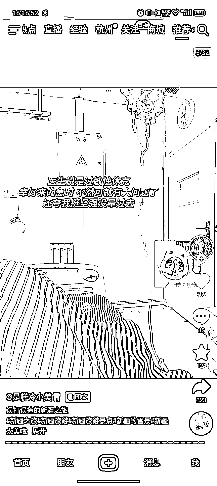
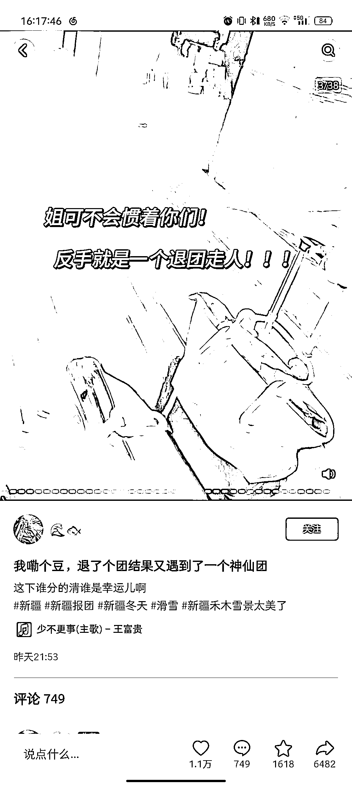
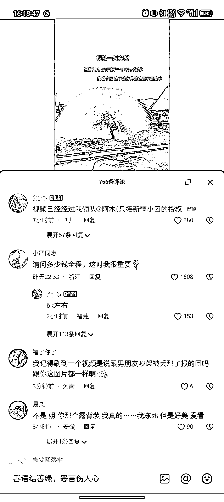
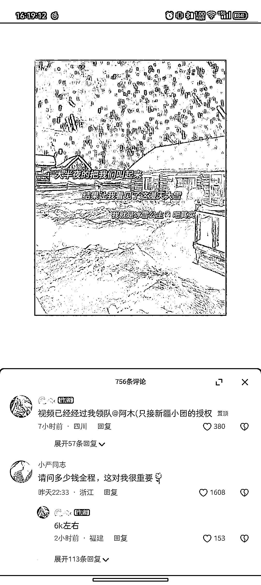
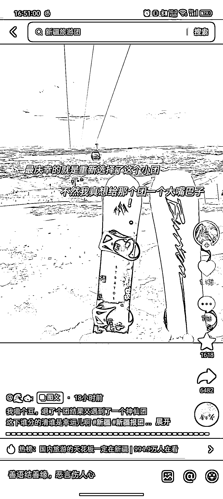

# 抖音新引流玩法：离谱剧情+产品宣传+评论区引流

> 原文：[`www.yuque.com/for_lazy/xkrm14/gsk4yu9wnl7k8eex`](https://www.yuque.com/for_lazy/xkrm14/gsk4yu9wnl7k8eex)

作者： 二三

日期：2023-10-10

点赞数：**91**

* * *

正文：

抖音图文新引流玩法： 离谱剧情（3-5 张图）+产品宣传（十几张图不等）+评论区引流，BGM 用「大学生脆脆鲨」系列的《少不更事》
以旅游团引流为例，前几张图编一个用于留观的故事，然后接旅游宣传的一堆图片（图片真实感较强，且好看）。
目前看到的离谱故事有：在家吃菠萝过敏送医、报旅行团被坑、跟男朋友出门玩半路吵架被扔下…… 旅游宣传图片如：美景美食、新奇项目、领队的人性化服务等等；
评论区引流：①直接自己评论@领队抖音号，说把人@过来了，引导大家去找本人；②请水军评论找人，再回复水军，完成引流。
目前这个玩法在新疆旅游团玩的很多，其他旅游宣传也可以参考，再放大一步说，如果自己产品能贴合这种宣传方式，也可以尝试。
蛮佩服第一个想出这种玩法的人，第一次刷到的时候真没觉得是广告，直到刷到第二个第三个才反应过来。
抖音每隔段时间总有一些热门内容类型，比如最近有一块风向是「大学生很脆弱」的图文视频，都是大学生离谱事件+BGM《少不更事》，所以当大家刷到你以这样类似的开头作引入，第一时间都难以察觉是广告，就算后续察觉到，你也完成了宣传，或已经完成了引流。
下次再有类似热点，依然能参考该思路。

* * *

评论区：

朱朱侠 : 看我理解的对不对？ 旅游博主：旅游途中+雷人事件 汽车博主：验车途中+雷人事件 衣服博主：购衣途中+雷人事件 美食博主：吃饭途中+雷人事件

二三 : 事件前置，放在最前面，后面衔接产品图。比如旅游产品的就是放风景、食宿、游玩等图片，线下餐饮产品就可以是美食、就餐环境、服务等图片……就以此类推，主打一个真实感和故事感

二三 : 抖音搜“新疆旅游”，应该能找到我上图举例的视频，可以看看感受下[机智]

朱朱侠 : 嗯嗯，刚刚搜了一下，确实是雷人事件前置[呲牙]

梁有鱼🐟 : 难道我标签不对？我搜没有[尴尬]

来颗苹果咩 : 不说真的不知道是引流，二三老师好厉害[强]

胖大魔 : 开幕雷击。。。

* * *

