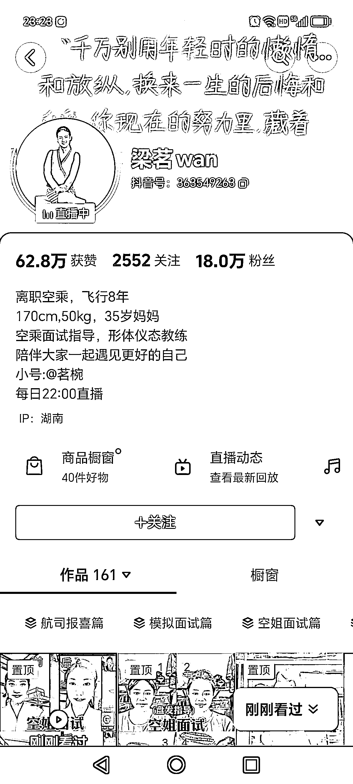

# 抖音空姐面试指导：挖掘高客单人群痛点，创造高客单产品赚钱模式

> 原文：[`www.yuque.com/for_lazy/xkrm14/rh1hbp7r0vx3srgg`](https://www.yuque.com/for_lazy/xkrm14/rh1hbp7r0vx3srgg)

作者： 春夏

日期：2023-10-12

点赞数：**38**

* * *

正文：

抖音，空姐面试指导，通过直播和视频突出成功案例。 这个账号目前有三个变现方式，挂橱窗，线上面试指导，线下培训指导，客单价应该很高，毕竟这类人群不差钱。
启发 1：想做高客单产品，先瞄准高客单人群，挖掘他们的痛点（最好是身处有钱人中，才有可能知道有钱人的痛点是啥）
启发 2：很多产品，都可以套用案例中的赚钱模式，采用以上三个变现方式。 启发 3：再小的痛点，都有无限的市场，人群精准精准再精准。

* * *

评论区：

胖大魔 : 很有钱也不会去当空姐呐，之前跑步时候认识挺多空姐的

春夏 : [玫瑰][玫瑰][玫瑰]

轻舟 : 颜值身材都不错吧

胖大魔 : 外航硬要求只有身高吧

* * *

