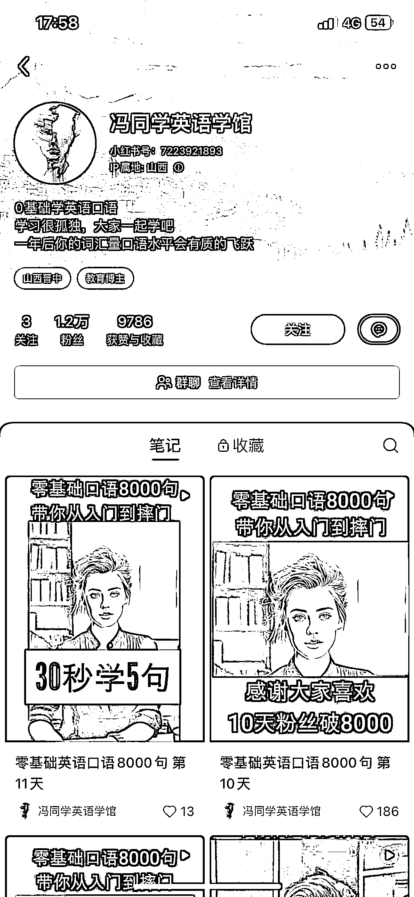

# Ai 代替真人，小红书账号 11 天吸引 1.2 万粉丝流量

> 原文：[`www.yuque.com/for_lazy/xkrm14/xx1ewiptkzs0iqhb`](https://www.yuque.com/for_lazy/xkrm14/xx1ewiptkzs0iqhb)

作者： Melissa.Zu*

日期：2023-09-28

点赞数：**131**

* * *

正文：

小红书账号仅仅 11 天时间，吸引 1.2 万粉丝流量，利用 Ai 代替真人每天分享几句基础英文口语听力，大部分都是搬运来的，用 Ai 细分领域真的涨粉飞速～

* * *

评论区：

张一会 : 音频是搬运来的吗？后续怎么变现呢？如果我是教小语种的老师，可以直接拉群然后引到私域吗？

Melissa.Zu* : 音频就是制作 AI 虚拟人物读出来的，ChatGPT 生成文本，你有小语种优势很大呀 ，建立帐号先在主页建群，引流到私域你可以视屏卖课呀，搞起来～

张一会 : 本身就有在做一对一的韩语教学的，而且也有帮助很多学生考级成功的经验和素材了。就是引流这块做得不是很好^u
感觉你发的这个账号形式可以模仿，而且用 ai 制作视频也很方便！就是还没有想通这个项目所有流程，或者我该先去干起来！

Melissa.Zu* : 先干起来，才知道会遇到哪些问题，有个人优势比忙找方向更容易，不清楚的就在生财帖子里搜索

华仔 : 数字人咋做

小鸽子 : 手机电脑剪映里面都有数字人这项了

Melissa.Zu* : 感谢亦仁大大[玫瑰]

* * *

公众号懒人找资源，懒人专属群分享