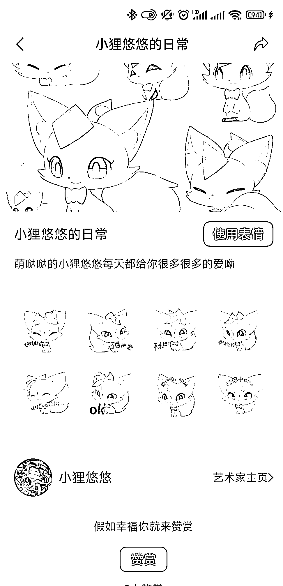

# midjourney 教你制作微信表情包，赚零花钱避坑指南

> 原文：[`www.yuque.com/for_lazy/xkrm14/uq1yhsk3xfmye6aq`](https://www.yuque.com/for_lazy/xkrm14/uq1yhsk3xfmye6aq)

作者： liliya

日期：2023-10-09

点赞数：**134**

* * *

正文：

midjourney 做可以搞钱的微信表情包避坑指南
8 月份 AI 航海结束的时候，我用 midjourney 生成的微信表情包审核通过并上架了。淘宝上一套表情包制作要上百块，现在分分钟出一套，想火有难度，如果大批量上架的话，赚一点零花钱还是没问题的呀！
表情包是一个装逼利器，甚至可以给朋友、孩子、宠物做定制表情包，如果自己有公司或者 IP 的，还可以做专属表情包，不会 PS 也没问题。结尾处还有我自己对于 AI 绘画变现的一些思考，具体请移步飞书：[`ekcwwaypjw.feishu.cn/docx/DreLd7jzeoHjTmxB...`](https://ekcwwaypjw.feishu.cn/docx/DreLd7jzeoHjTmxBVuLcaiLTnOe?from=from_copylink) 

* * *

评论区：

景思 : 避坑太重要了！可操作性很强哈~

Cece : 写得好详细呀

liliya : 是呀，因为踩了足够多的坑😂

珂侨同学 : 亦仁，为啥没有避坑栏目？

不等天亮等时光 : 太细了[强]

liliya : 谢谢[害羞]写了 2 周呢[抱拳]

liliya : [抱拳][抱拳]

* * *

