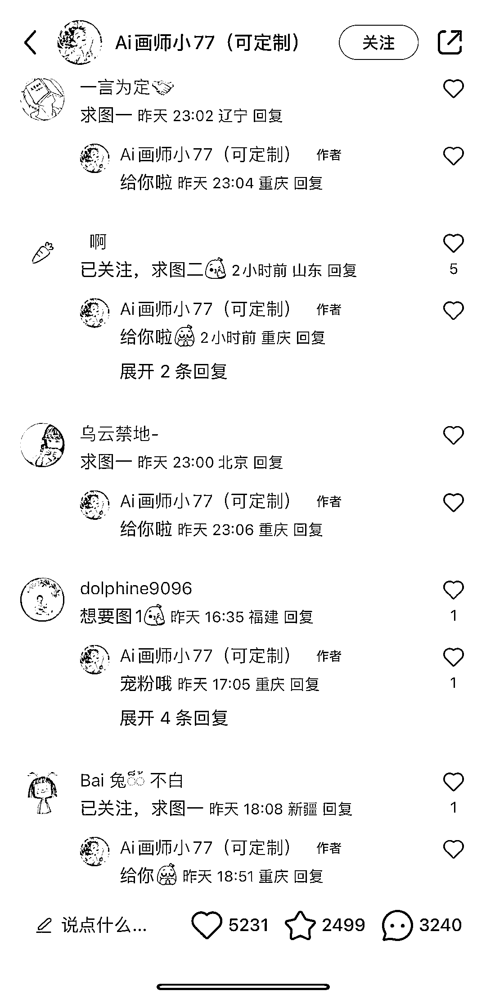

# 小红书国庆头像热潮，用 Ai 绘图定制个性头像

> 原文：[`www.yuque.com/for_lazy/xkrm14/cqtl2o6uqmnre8rf`](https://www.yuque.com/for_lazy/xkrm14/cqtl2o6uqmnre8rf)

作者： 艺荷

日期：2023-09-26

点赞数：**82**

* * *

正文：

小红书用 Ai 绘图定制国庆头像 借势国庆，又一个热点，以前是个人头像加国旗，现在做 Ai 动漫头像。 一篇笔记 5000 多赞，3000 多评论，清一色都是要图的。
设置了两个群聊，都快满员了。 引流私域+卖图赚钱，一举两得。 已经在搞 Ai 绘图的可以赶紧跟进啦～

* * *

评论区：

艺荷 : 哇哦，第一次中标，感谢亦仁大大

David Tree* : 这种 AI 头像用什么软件可以做出来啊

艺荷 : 我也不清楚哎，咱们星球应该有相应的帖子

菲菲 : 用 MJ 做出来的，主页里写啦[偷笑]

David Tree* : 哦没看清，谢谢

* * *

