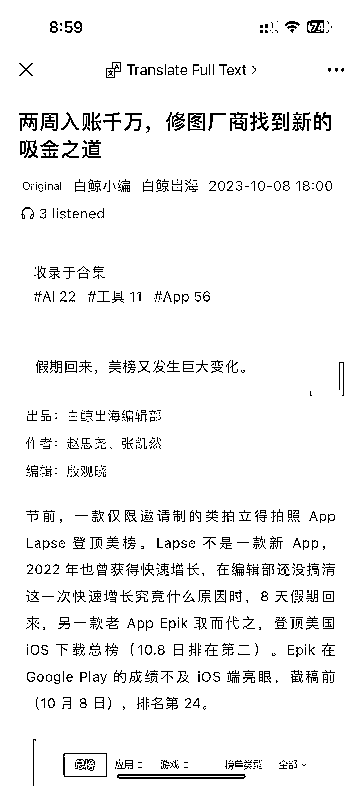
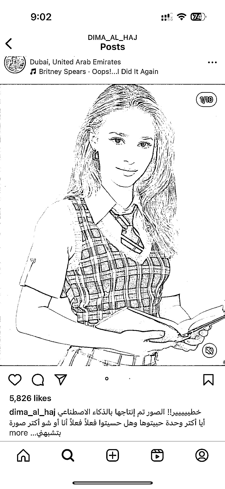
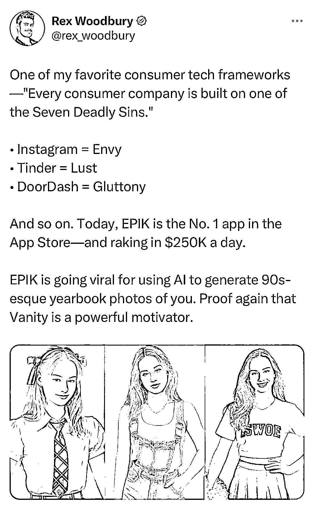

# 九十、年代 AI 照片：背后公司牛逼，满足人类七宗罪的底层设计逻辑

> 原文：[`www.yuque.com/for_lazy/xkrm14/szs4ckqu9lb1g7m4`](https://www.yuque.com/for_lazy/xkrm14/szs4ckqu9lb1g7m4)

作者： TingTing

日期：2023-10-09

点赞数：**69**

* * *

正文：

最近海外和小红书爆火的 90 年代 AI 照片，刷的时候就在想背后的公司牛逼。附上一个投资人的点评，满足人类七宗罪（类似于国内说的黄赌毒）的欲望是所有火爆产品的底层设计逻辑。

* * *

评论区：

TingTing : 开心！不过这个为什么标记是小红书呢？

Sunwei : 背后公司是 Snow，比如 B612 咔叽是其 App

TingTing : 是的

* * *

公众号懒人找资源，懒人专属群分享