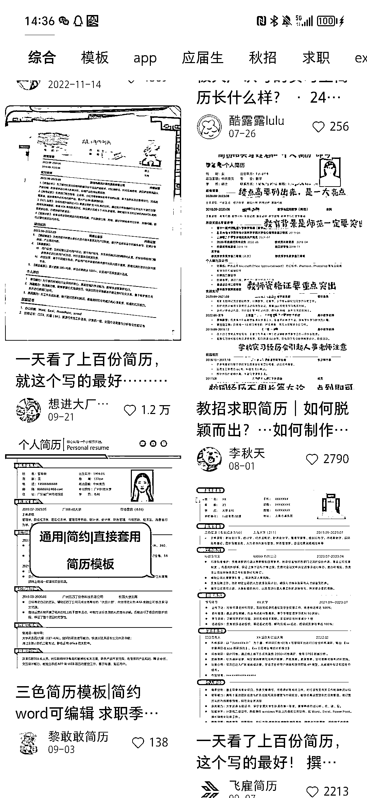

# 低成本易操作的自由项目，利用 AI 代写简历引流

> 原文：[`www.yuque.com/for_lazy/xkrm14/fn5g1ioff6eno04n`](https://www.yuque.com/for_lazy/xkrm14/fn5g1ioff6eno04n)

作者： 雨轩

日期：2023-10-10

点赞数：**62**

* * *

正文：

低成本易操作的自由项目，面向的客户群体很广，主要是引流+利用 AI 代写简历、评估修改简历，目前秋招旺季求职毕业生简历修改和代写需求很大，小红书很多人用简历模板做分享引流，评论区留言的需求呼声也很大，当前求职竞争大，个人简历的质量对求职者来说很重要，值得花点费用去优化，可以根据不同人群不同需求个性化定价

* * *

评论区：

朱朱侠 : 简历是入职前比较刚需的痛点，那应届生入职后比较刚需的痛点有哪些可以用来做一波引流呢？

雨轩 : 感谢亦仁大大[玫瑰]

雨轩 : 比如入职后工作经验不足、不擅长处理同事关系、权益保护等等，可以提供一些职场建议，分享经验开导和帮助应届生适应职场

艾小飞 : 提问得好[强]

* * *

公众号懒人找资源，懒人专属群分享