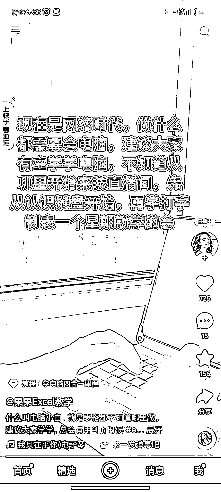
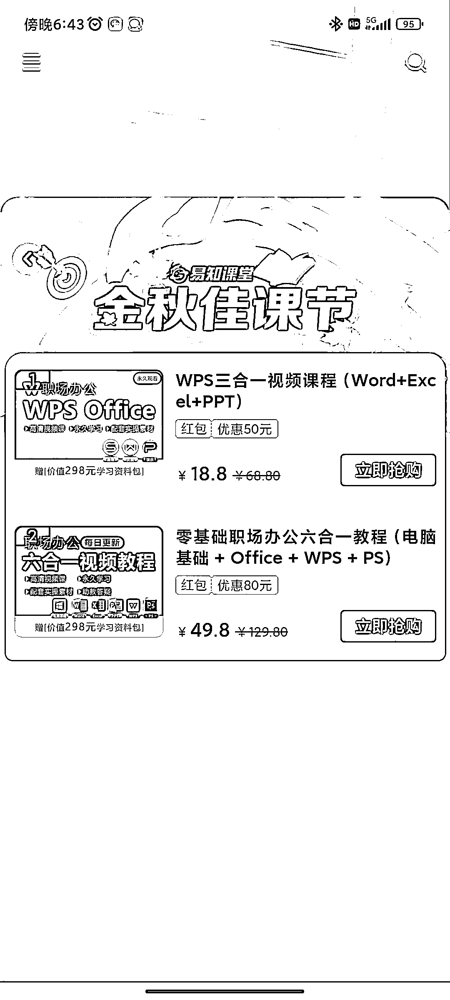

# 下沉市场的知识付费：教老人使用微信、网购和下载 app 的课程大热销

> 原文：[`www.yuque.com/for_lazy/xkrm14/ln4yk2kd8xniq5t9`](https://www.yuque.com/for_lazy/xkrm14/ln4yk2kd8xniq5t9)

作者： 进哥哥

日期：2023-09-28

点赞数：**109**

* * *

正文：

下沉市场的知识付费，简单的电脑使用教程课程也能卖 2.4 万分，主打的是低价和入门知识的培训，由此是否可以录制课程教老人如何使用微信，教老人如何网购，如何下载 app，这些使用方法对年轻人来说是轻车熟路，但是对老年人来说太复杂了，引流也很简单，个人认为里面应该还是有很多机会。

* * *

评论区：

* * *

公众号懒人找资源，懒人专属群分享