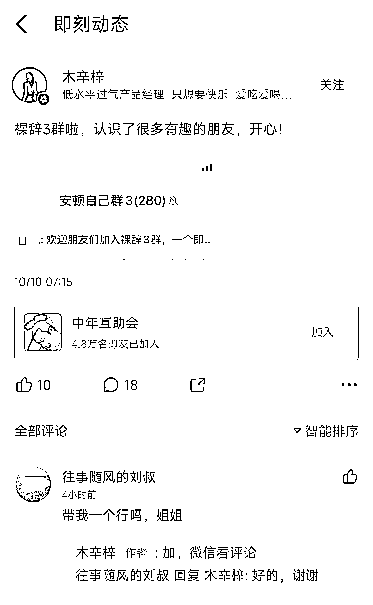

# 在即刻看到的裸辞群帖子，短短 10 天已经建了 3 个群啦

> 原文：[`www.yuque.com/for_lazy/xkrm14/kxbg35m7kbvqn3qm`](https://www.yuque.com/for_lazy/xkrm14/kxbg35m7kbvqn3qm)

作者： 一舟

日期：2023-10-11

点赞数：**100**

* * *

正文：

在即刻看到的裸辞群帖子，短短 10 天已经建了 3 个群啦，大概算下引流私域也得快 1000 人了，而且流量精准，即刻的用户质量也很高，目前即刻引流也不严，评论区就可以留微信号。

* * *

评论区：

周彦充 : 我也去发一个试试，

朝暮拾花 : 马上行动

朱朱侠 : 试过之后的效果怎么样[调皮]

肥仔梁 : 试过之后的效果怎么样

一舟 : 感谢亦仁～

艾小飞 : 举一反三，可以换成别的项目试试

三分热度番茄君 : 总结： ①又是一个 app 流量的例子，寻找流量洼地 ②也是一个跟年龄相关的话题。即刻是一个小众的年轻人 app，年轻人匹配裸辞。这个话题选的好，年轻人中容易爆。
③裸辞群的都是对现有工作不满意的，变现可以卖就业类项目，简历修改，名企面试帮扶，职业技能培训

* * *

