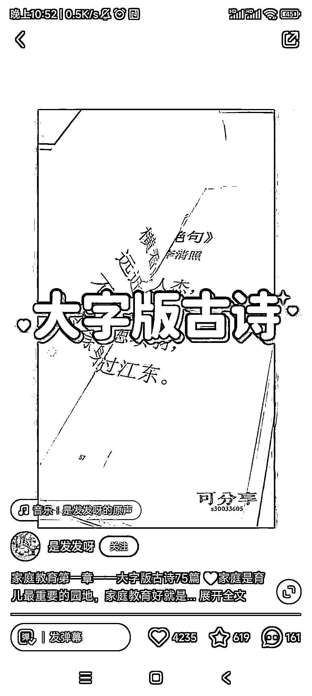
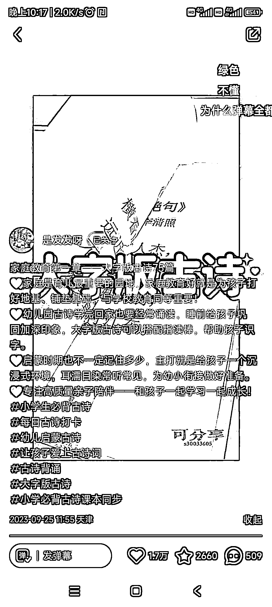

# 幼儿教育资料爆款流量模板，图三一天内获得万赞

> 原文：[`www.yuque.com/for_lazy/xkrm14/ymu1g7y6dzvlgign`](https://www.yuque.com/for_lazy/xkrm14/ymu1g7y6dzvlgign)

作者： 定心

日期：2023-09-27

点赞数：**93**

* * *

正文：

一个做幼儿教育资料的可以参考的爆款流量模板 图一和图二隔了三个小时➕1500 赞 图三是一天后，万赞 起号也很好用，这个博主也是低粉爆款

* * *

评论区：

认知小窗-认哥 : 也刷到过这个，敏感度有待提升啊

阿懒 : 右下角是留 v 了吗

止止 : 去看了，这个视频做的非常粗糙，中间静止还卡住，不知道为什么会火[呲牙]

定心 : 还是抓住了核心需求。大字，古诗

三分热度番茄君 : 视频只是突出了核心卖点--大字 胜出是在文案

定心 : 感谢老大

定心 : 不完全是，是因为客户需求就是要一页一首诗

* * *

