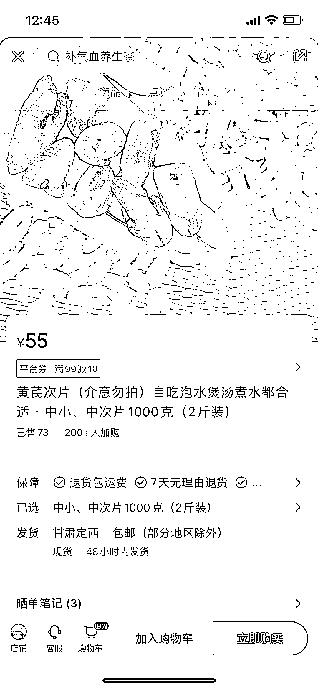

# 利用微瑕疵切入点，开创新的销售市场

> 原文：[`www.yuque.com/for_lazy/xkrm14/tpwvi4fe7ao5a7uo`](https://www.yuque.com/for_lazy/xkrm14/tpwvi4fe7ao5a7uo)

作者： 不讲段子的段子手

日期：2023-09-26

点赞数：**79**

* * *

正文：

上次看到一位圈友卖断腿大闸蟹的精华帖，今天又小红书刷到了卖残片黄芪的商家。
想起来有段时间买零食边角料很火，另外平常去蛋糕店买蛋糕时候，都有戚风蛋糕的边角料可以买，几块钱买一大包。
这种可以延伸到各个行业，微瑕疵不影响正常功能的用品，线头小污渍不影响穿着的衣服，不好看或外观缺损的食物，都可以作为切入点去卖。

* * *

评论区：

不讲段子的段子手 : 谢谢亦仁老师！

昊东.Lee : 卖这种瑕疵品确实是一门值得挖掘的生意，特别是一些高客单高溢价的产品，还有一种超常规产品也可以，想起之前去地里拉西瓜红红薯卖，常规大小的好看，价格也要贵一些，小红薯个头小不好看，价格也卖不上，但是这种小红薯打包成 10 斤或 20 斤一包去低价卖，走的却很好，总体算下来比卖大个利润还高些。
所以很多生意不光看单笔成交的价格和利润，销量人气和周转次数也非常重要。
大家看不上的，被低估的东西，只要你能试出市场需求，找到需求人群，然后以低价或估堆承包的形式买下来，就能赚到钱，例如布厂残次品和布头，可以再加工成鞋垫；不规则珍珠，可以做个性化产品，你的美独一无二，情侣首饰。

不讲段子的段子手 : 想起了巴洛克珍珠，直接开蚌的巴洛克卖不上价格，但是做成小幽灵样式，或者单独开个店卖巴洛克，每个都起个好听的名字，一颗就能卖几百块。

行知 : 这个厉害👍🏻

* * *

