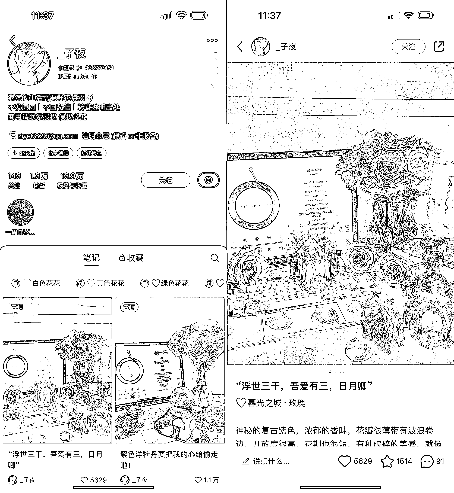

# 低成本搭建家居桌面美学，涨粉 1.3 万，单笔广告变现千元+

> 原文：[`www.yuque.com/for_lazy/xkrm14/rz88pb7pk9weyrps`](https://www.yuque.com/for_lazy/xkrm14/rz88pb7pk9weyrps)

作者： 蔡文静好文静

日期：2023-09-26

点赞数：**78**

* * *

正文：

可复制的小红书玩法：低成本搭建家居桌面美学 涨粉 1.3 万，单笔广告变现千元+。拍了发了 150 篇笔记以上 内容玩法：
1、固定一个场景和拍摄角度：手提电电脑显示网易云播放页面）+同色系鲜花 2、标题和正文内容，都偏向于情感类文案
3、打造理想生活场景，粉丝会自发下载图片作为壁纸和配图等。家居小摆件，可以从拼多多淘宝等搜同款买 引流钩子： 个人简介里写了邮箱（广告报备与非报备）
变现方式： 1、目前主要接商业广告 2、未来还可以扩展到鲜花行业、静物摄影，家居行业等更多商业玩法

* * *

评论区：

蔡文静好文静 : 谢谢亦仁老师~

* * *

